# Архитектура приложения «Региональная модель»

> Техническое описание системы. Все диаграммы — Mermaid (валидны для GitHub/GitLab/IDE).
> Факты взяты из кода репозитория; предположения помечены `Assumption`, незавершённое — `TODO`.

---

## 1. Overview

**Назначение.** Веб-приложение для инженера-моделировщика нефтегазового актива:
визуальное проектирование и хранение региональной модели — объектов (системы сбора,
объекты подготовки, точки поставки), трубопроводов и их сегментов, тройников, врезок,
лицензионных участков; просмотр свойств объектов и (в перспективе) расчёты.

**Основные части системы**

| Часть | Технология | Расположение |
|---|---|---|
| Frontend | React 18 + TypeScript 5 (strict) + Vite 6 | `frontend/` |
| Backend | Django 5 + Django REST Framework (DRF) | `backend/` |
| Database | PostgreSQL 16 (без PostGIS; координаты `lat`/`lng`) | контейнер `db` |
| Внешние сервисы | Растровые тайлы карт: Esri World Imagery, OSM | запросы напрямую из браузера |
| Аутентификация | **Не реализована** (`TODO`, см. §9) | — |

**Границы ответственности**

- **Frontend** — отрисовка гео-карты и графа, ручные манипуляции (перемещение/ресайз/
  создание/удаление), инспектор, дерево объектов, сохранение/загрузка сценариев. Вся
  *визуальная* логика и гео-математика — здесь.
- **Backend** — источник истины для сохранённой модели: хранение сущностей, выдача
  контрактов для фронтенда (`map/graph`, `entities/{id}`), атомарное сохранение снимка
  проекта (`map/save`), загрузка (`map/load`), постановка расчётов.
- **Database** — персистентное хранение проектов и их содержимого.
- **External** — тайлы карт (только чтение, из браузера; backend не проксирует).

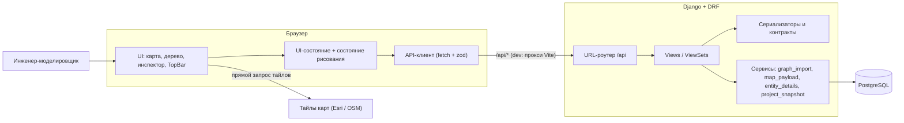

---

## 2. System Context

Внешние акторы и системы:

| Компонент | Тип | Назначение |
|---|---|---|
| **Инженер-моделировщик** | актор | Единственный пользователь системы (роли не реализованы — `TODO`). |
| **Frontend** (браузер) | контейнер | UI, карта, граф, вызовы API. |
| **Backend API** | контейнер | REST API, бизнес-логика, доступ к БД. |
| **PostgreSQL** | хранилище | Хранение проектов, сущностей, результатов расчётов. |
| **Esri World Imagery** | внешний сервис | Растровые тайлы спутниковых снимков (basemap `satellite`). |
| **OpenStreetMap** | внешний сервис | Растровые тайлы топографической схемы (basemap `topo`). |
| **Auth provider** | — | **Отсутствует** (`TODO`): JWT-аутентификация не реализована. |
| **Расчётное ядро (ГР/гидравлика)** | внешняя/внутренняя | **Не реализовано** (`TODO`): есть только постановка задачи `CalculationRun` и чтение результатов. |

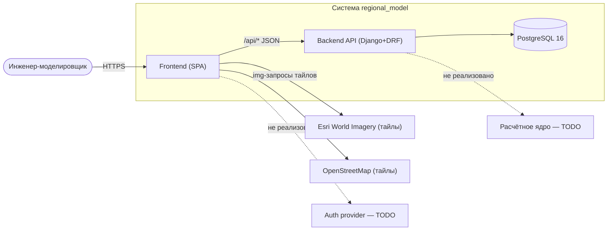

> **Assumption.** В продакшене frontend и backend предполагаются за одним origin
> (или с прокси), т.к. API-клиент использует относительный префикс `/api`.
> В dev — Vite-прокси (`frontend/vite.config.ts`) на `http://localhost:8000`.

---

## 3. Frontend Architecture

Стек: React 18, TypeScript strict, Vite 6, `@tanstack/react-query` (server-state),
`zod` (валидация ответов), `vis-network` (только Вариант 1 карты).

**Слои и модули**

| Слой | Модули | Ответственность |
|---|---|---|
| Root composition | `App.tsx`, `main.tsx` | Сборка зон (TopBar + AppShell), провайдеры (react-query, uiState, mapDrawing), хоткеи (undo/redo, Delete). |
| Layout | `app/AppShell.tsx`, `ActivityBar.tsx`, `PanelResizer.tsx` | Оверлейная раскладка: карта на весь экран, панели поверх. |
| Feature: map | `features/map/*` | Камера, тайлы, граф на гео-карте, манипуляции, снап, экспорт, импорт участка. |
| Feature: objectTree | `features/objectTree/*` | Дерево объектов, панель «Проектирование» (`GraphToolbar`), левый sidebar. |
| Feature: inspector | `features/inspector/*` | Карточка объекта, вкладки, связи. |
| Feature: diagram | `features/diagram/*` | Плавающая модалка «Диаграмма на карте». |
| Feature: displaySettings | `features/displaySettings/*` | Тумблеры отображения карты, выбор подложки. |
| Feature: topbar | `features/topbar/*` | Верхняя панель: режим, сценарии, сохранение с прогрессом. |
| API layer | `api/client.ts`, `queries.ts`, `mapSave.ts`, `useSaveGraph.ts`, `mockData.ts` | HTTP-запросы, zod-валидация, react-query хуки, fallback на мок. |
| Domain | `domain/types.ts`, `schemas.ts` | Доменные типы и zod-схемы контрактов. |
| State | `state/uiState.tsx`, `features/map/mapDrawing.tsx` | UI-состояние и состояние подсистемы рисования (domain layer графа). |
| Components | `components/*` | Переиспользуемые UI (AppIcon, IconRegistry, ErrorBoundary, ProgressBar, ToggleSwitch). |
| Styles | `styles/tokens.css`, `typography.css` | CSS-переменные и типографика. |

**Ключевая архитектурная особенность — «domain layer» графа** живёт во фронтенде:
`features/map/mapDrawing.tsx` (React-контекст) хранит `vertices / segments / fittings /
taps / areas / pipelines` и всю логику редактирования; сохранение в БД — отдельный
шаг по кнопке.

**Панель «Проектирование» — настройка трубопровода** (макет `проектирование__трубопровод`,
см. `PipelineSettingsPanel`): перед рисованием задаются две независимые характеристики
ребра — **флюид** (цвет линии: Нефть / Газ / Продукт) и **класс трубопровода**
(стиль линии: промысловый / межпромысловый / магистральный / логический поток).
Цвет и класс ортогональны и оба проносятся в domain layer (`DrainFluid`,
`PipelineClass` в `drawingTypes.ts`) → в payload (`pipeline_class`) → в БД и обратно.
При отрисовке толщина/штрих ребра берётся из класса (`getPipelineClassStyle`),
цвет — из флюида (`getFluidColor`).

```mermaid
flowchart TD
    Main["main.tsx<br/>провайдеры"]
    App["App.tsx<br/>композиция + хоткеи"]

    TopBar["features/topbar"]
    Shell["app/AppShell + ActivityBar"]
    Left["features/objectTree/LeftSidebar"]
    Map["features/map/MapViewport"]
    Insp["features/inspector"]
    Diagram["features/diagram/MapDiagramModal"]

    MapDrawing["features/map/mapDrawing (контекст)"]
    MapHelpers["features/map/mapDrawingHelpers (чистые функции)"]
    Geo["features/map/geo (Mercator)"]
    Snap["features/map/snap"]
    Heal["features/map/healSplits"]
    Split["features/map/splitSegmentByTap"]
    ImportArea["features/map/importLicenceArea"]
    GeoGraph["features/map/GeoGraphLayer"]
    GeoMap["features/map/GeoMapOnly"]
    VisLayer["vis-слой (Вариант 1): VertexBoxes, BasemapTiles, GhostPreview, FlowAnimation, EdgeDataBadges"]

    ApiClient["api/client + mapSave"]
    Queries["api/queries + useSaveGraph (react-query)"]
    Schemas["domain/schemas (zod)"]
    UiState["state/uiState"]

    Main --> App
    App --> TopBar
    App --> Shell
    Shell --> Left
    Shell --> Map
    Shell --> Insp
    App --> Diagram

    TopBar --> Queries
    Queries --> ApiClient
    ApiClient --> Schemas

        Map --> GeoMap
        Map --> GeoGraph
        Map --> MapDrawing
        Map --> VisLayer
        MapDrawing --> MapHelpers
        MapDrawing --> Heal
        MapDrawing --> Split
        GeoGraph --> Geo
        GeoGraph --> Snap
        Map --> ImportArea
        TopBar --> MapDrawing
        App --> UiState
        Left --> UiState
    ```

---

## 4. Frontend Component Map

| Component | Responsibility | Dependencies | Input | Output |
|---|---|---|
| `AppShell` | Оверлейная раскладка зон (Activity/Sidebar/Map/Inspector), ресайз панелей | `panelWidth`, `PanelResizer`, `PanelRestoreBar` | слоты + ширины | UI-каркас |
| `ActivityBar` | Навигация разделов + кнопка dev-режима | `uiState`, `AppIcon` | `activeModule`, `devMode` | `onModuleChange`, `onToggleDevMode` |
| `TopBar` | Верхняя панель: режим, «Сценарии», «Сохранить», «Рассчитать» | `ViewModeSwitch`, `ScenarioButton`, `SaveGraphControl`, `CalculateButton` | `viewMode`, крошки | колбэки |
| `ScenarioButton` | Меню сохранённых сценариев (загрузка/удаление) | react-query, `api/mapSave` | — | `onOpen(id,name)` |
| `SaveGraphControl` | Сохранение графа с диалогом имени и прогрессом | `useSaveGraph`, `ScenarioDialog`, `useMapDrawing` | — | POST `/map/save/` |
| `MapViewport` | Точка сборки карты: режим `MAP_ONLY`, камера, обработчики | `GeoMapOnly`, `GeoGraphLayer`, `mapDrawing`, vis-слой | `displaySettings`, `selectedId` | карта + граф |
| `GeoMapOnly` | Чистая растровая карта: тайлы, зум к курсору, пан (Ctrl+ЛКМ), фокус, `onMapClick`, `onCursorMove` | `geo.ts` | `basemap`, `devMode` | камера, клик |
| `GeoGraphLayer` | Отрисовка/интерактив графа: объекты, рёбра, точки, участки, лассо | `geo`, `drawingTypes`, `mapColors` | данные графа, камера | вызовы операций |
| `MapDrawingProvider` / `useMapDrawing` | **Domain layer** графа: данные + все операции + undo/redo | `mapDrawingHelpers`, `healSplits`, `splitSegmentByTap` | — | контекст |
| `GraphToolbar` | Панель «Проектирование» (кнопки инструментов + панель настроек трубопровода) | `AppIcon`, иконки PNG, `PipelineSettingsPanel` | `activeAction`, `fluid`, `pipelineClass` | `onAction(id)`, `onFluidChange`, `onPipelineClassChange` |
| `PipelineSettingsPanel` | Секция «Трубопроводы» в «Проектировании»: флюид (Нефть/Газ/Продукт) + класс трубопровода (промысловый/межпромысловый/магистральный/логический) | `drawingTypes`, `mapColors`, `FLUID_LABELS` | `fluid`, `pipelineClass` | `onFluidChange`, `onPipelineClassChange` |
| `ObjectTree` | Дерево объектов (группы/узлы, видимость, диаграмма) | `mockData`, `AppIcon` | `selectedId`, `hiddenIds` | колбэки |
| `InspectorPanel` | Карточка объекта: параметры, статус модели, связи | `entityDetails`, react-query | `entity`, `loading`, `error` | вкладки, переходы |
| `DisplaySettingsCard` | Тумблеры отображения + выбор подложки | `ToggleSwitch`, `BasemapSelector` | `settings` | `onChange(patch)` |
| `api/client` | HTTP + zod-валидация + fallback на мок | `domain/schemas`, `mockData` | path | typed response |
| `api/useSaveGraph` | Асинхронное сохранение с этапами прогресса | `useMutation`, `mapSave` | `MapSaveInput` | `MapSaveResult` |
| `ErrorBoundary` | Локализация ошибок рендера (не «белый экран») | — | children | фолбэк-UI |

```mermaid
flowchart TD
    TopBar --> ScenarioButton
    TopBar --> SaveGraphControl
    SaveGraphControl --> ScenarioDialog
    SaveGraphControl --> UseSaveGraph
    UseSaveGraph --> MapSaveApi["api/mapSave"]
    UseSaveGraph --> MapDrawingHook["useMapDrawing"]
    ScenarioButton --> MapSaveApi

    MapViewport --> GeoMapOnly
    MapViewport --> GeoGraphLayer
    MapViewport --> MapDrawingHook
    MapDrawingHook --> Helpers["mapDrawingHelpers"]
    MapDrawingHook --> HealSplits
    MapDrawingHook --> SplitTap

    GeoGraphLayer --> GeoLib["geo.ts"]
    GeoGraphLayer --> SnapLib["snap.ts"]
    GeoMapOnly --> GeoLib
    MapViewport --> VisLayer
```

---

## 5. Backend Architecture

Стек: Django 5 + DRF, PostgreSQL, `django-cors-headers`, gunicorn (в Docker).
Приложение — одно: `core`.

| Слой | Реализация | Ответственность |
|---|---|---|
| HTTP/API | `config/urls.py` → `core/urls.py` | Маршрутизация `/api/*` |
| Routes / Controllers | `core/views.py` (ViewSets + `@api_view`) | Разбор запроса, выбор проекта, ответ |
| Serializers | `core/serializers.py` | Валидация, сериализация, **контракты фронтенда** (`MapGraph`, `EntityDetails`) |
| Validation | DRF-сериализаторы + `GraphImportError` | Валидация входных данных и связей |
| Business logic | `core/services/*` | Сборка графа, снимок/импорт, детали объекта, гео-расчёты |
| Data access | Django ORM (модели в `core/models.py`) | Чтение/запись БД |
| Background jobs | **Отсутствуют** (`TODO`) | — |
| External integrations | **Отсутствуют** | — |
| Authentication | **Отсутствует** (`TODO`) | `UNAUTHENTICATED_USER: None` |
| Authorization | **Отсутствует** (`TODO`) | — |
| Logging | Стандартный stderr Django/gunicorn | Диагностика через `docker compose logs` |

**Где находится бизнес-логика:** в сервисном слое `core/services/` —
`map_payload.py` (сборка графа для карты), `graph_import.py` (атомарное сохранение
снимка проекта), `project_snapshot.py` (чтение снимка), `entity_details.py`
(карточка инспектора), `common.py` (geo-утилиты, выбор проекта). Views — «тонкие».

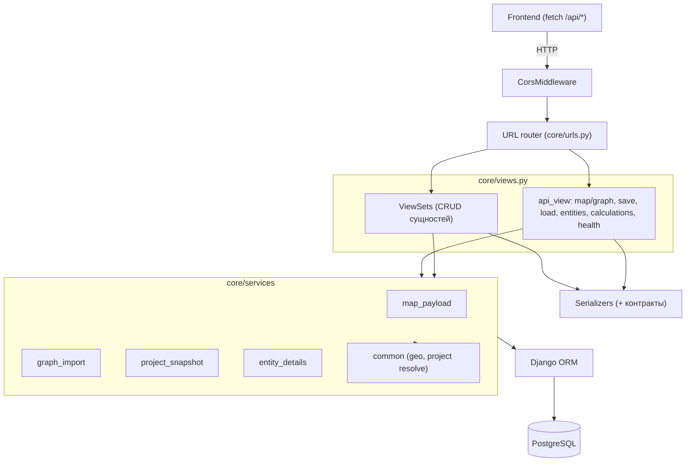

---

## 6. Backend Components

| Component | Responsibility | Dependencies | Input | Output |
|---|---|---|
| `health` (`GET /api/health/`) | Проверка живости сервиса | — | — | `{status, service}` |
| `map_graph` (`GET /api/map/graph/`) | Граф карты в контракте фронтенда | `map_payload.build_map_graph`, `MapGraphSerializer` | `project_id?` | `{nodes, edges}` |
| `map_save` (`POST /api/map/save/`) | Атомарное сохранение снимка проекта | `common.resolve_project_for_save`, `graph_import.save_map_graph` | снимок + `project_name`/`project_id` | `{project_id, counts, project_name}` / 400 |
| `map_load` (`GET /api/map/load/`) | Полный снимок проекта для domain layer | `project_snapshot.build_project_snapshot` | `project_id` / `project_name` | снимок / 404 |
| `entity_details` (`GET /api/entities/<uuid>/`) | Карточка объекта/трубопровода | `entity_details.build_entity_details` | uuid | `EntityDetails` / 404 |
| `ProjectViewSet` | CRUD проектов (сценариев) | `ProjectSerializer` | — | JSON / 204 |
| `FacilityViewSet` | CRUD объектов + `POST {id}/nodes/` | `FacilitySerializer`, `NetworkNode` | объект/точка | JSON |
| `NetworkNodeViewSet` | CRUD узлов (vertex/tee/tap) | `NetworkNodeSerializer` | — | JSON |
| `NetworkSegmentViewSet` | CRUD сегментов (+ авто-длина haversine) | `NetworkSegmentSerializer` | 2 узла | JSON |
| `PipelineViewSet` | CRUD трубопроводов + `POST from-segments/` | `PipelineSerializer`, `PipelineSegment` | `segment_ids` | JSON |
| `LicenceAreaViewSet` | CRUD лицензионных участков (полигон ≥3 точки) | `LicenceAreaSerializer` | polygon | JSON |
| `FlowViewSet` | CRUD логических потоков | `FlowSerializer` | source/target | JSON |
| `calculation_start/status/results` | Постановка расчёта и чтение `GRResult` | `CalculationRun`, `GRResult` | project_id / run_id | JSON |
| `graph_import.save_map_graph` | **Основная бизнес-логика сохранения**: транзакционная замена содержимого проекта, дедупликация, привязки врезок | ORM | payload | counts |
| `map_payload.build_map_graph` | Преобразование доменной модели в контракт карты | ORM | project | nodes/edges |

---

## 7. API Architecture

Базовый префикс — `/api`. Аутентификация **отсутствует** (см. §9) — все эндпоинты
доступны без токена. Если API ещё в планах — помечено `TODO / Proposed API`.

| Method | Endpoint | Auth | Purpose | Request | Response | Errors |
|---|---|---|
| GET | `/api/health/` | none | Живость сервиса | — | `{status:"ok",service:"regional-model"}` | — |
| GET | `/api/map/graph/` | none | Граф карты | `?project_id=` | `{nodes:[{id,label,kind,entityId}], edges:[{id,from,to,fluid,flowLabel}]}` | 404 (нет проекта) |
| POST | `/api/map/save/` | none | Сохранить снимок проекта | снимок + `project_name`/`project_id` | `{project_id, project_name, counts}` | 400 (валидация/связи) |
| GET | `/api/map/load/` | none | Загрузить снимок проекта | `?project_id=` или `?project_name=` | полный снимок (`facilities/nodes/segments/pipelines/licence_areas`) + `counts` | 404 (сценарий не найден) |
| GET | `/api/entities/<uuid>/` | none | Карточка объекта/трубопровода | uuid | `EntityDetails` | 404 |
| POST | `/api/calculations/start/` | none | Поставить расчёт | `project_id?` | `CalculationRun` | — |
| GET | `/api/calculations/<uuid>/` | none | Статус расчёта | run_id | `CalculationRun` | 404 |
| GET | `/api/calculations/<uuid>/results/` | none | Результаты по годам | `run_id`, `?year=` | `GRResult[]` | 404, 400 (год) |
| GET | `/api/projects/` | none | Список сценариев | — | `Project[]` | — |
| POST | `/api/projects/` | none | Создать проект | `{name, slug}` | `Project` | 400 |
| GET/PUT/PATCH/DELETE | `/api/projects/<uuid>/` | none | CRUD проекта (DELETE каскадно) | — | JSON / 204 | 404 |
| GET/POST | `/api/facilities/` | none | Список/создание объектов | `{name,kind,lat,lng,...}` | `Facility` | 400 |
| GET/PUT/PATCH/DELETE | `/api/facilities/<uuid>/` | none | CRUD объекта | — | JSON / 204 | 404 |
| POST | `/api/facilities/<uuid>/nodes/` | none | Узел, привязанный к объекту | `{lat,lng,name?,kind?}` | `NetworkNode` | 400 |
| GET/POST | `/api/nodes/` , `/api/nodes/<uuid>/` | none | CRUD узлов | `{name,kind,lat,lng,facility?}` | `NetworkNode` | 400/404 |
| GET/POST | `/api/segments/` , `/api/segments/<uuid>/` | none | CRUD сегментов (длина считается, если не задана) | `{start_node,end_node,fluid}` | `NetworkSegment` | 400/404 |
| GET/POST | `/api/pipelines/` , `/api/pipelines/<uuid>/` | none | CRUD трубопроводов (`segment_ids` на запись) | `{name,fluid,segment_ids}` | `Pipeline` | 400/404 |
| POST | `/api/pipelines/from-segments/` | none | Создать трубопровод из сегментов | `{segment_ids,name?,fluid?}` | `Pipeline` | 400 |
| GET/POST | `/api/licence-areas/` , `/api/licence-areas/<uuid>/` | none | CRUD участков | `{name,polygon:[[lng,lat],…]}` | `LicenceArea` | 400 (полигон <3) |
| GET/POST | `/api/flows/` , `/api/flows/<uuid>/` | none | CRUD логических потоков | `{source,target,flow_type,is_logical_flow}` | `Flow` | 400/404 |

> **TODO / Proposed API.** `POST /api/auth/login`, `/api/auth/refresh`, JWT-защита
> эндпоинтов — не реализованы (см. §9).

**Контракты фронтенда** (совпадают с zod-схемами `frontend/src/domain/schemas.ts`):

```jsonc
// GET /api/map/graph/
{
  "nodes": [{ "id": "…", "label": "Куст 1", "kind": "wellpad", "entityId": "…" }],
  "edges": [{
    "id": "…", "from": "…", "to": "…",
    "fluid": "oil|gas|product",
    "pipelineClass": "field|interfield|trunk|logical",
    "flowLabel": "—"
  }]
}
```

---

## 8. API Request Flow

### 8.1. Сохранение сценария (кнопка «Сохранить»)

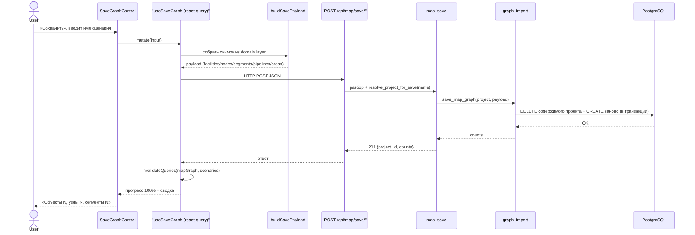

### 8.2. Загрузка сценария (кнопка «Сценарии» → выбор проекта)

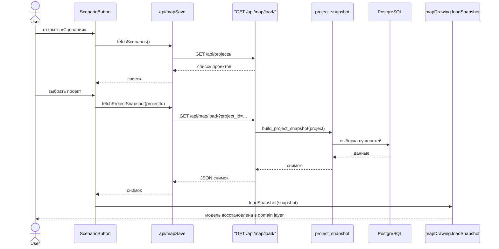

### 8.3. Получение карточки объекта (инспектор)

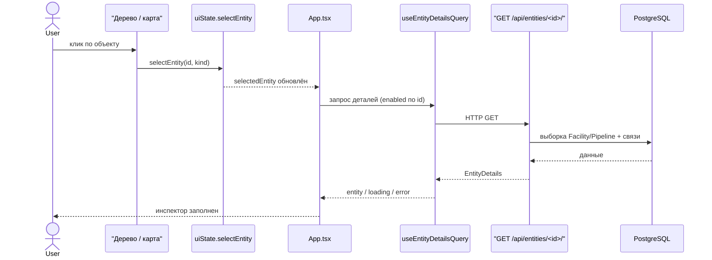

### 8.4. Создание объекта на карте (клик «Система сбора»)

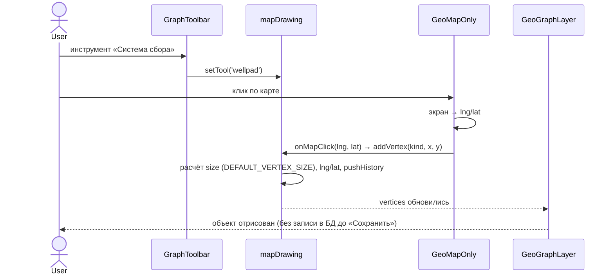

---

## 9. Authentication & Authorization

**Текущее состояние: не реализовано.** Факты:

- в `INSTALLED_APPS` нет JWT-библиотеки; в `REST_FRAMEWORK` —
  `"UNAUTHENTICATED_USER": None`;
- все эндпоинты `AllowAny` (по умолчанию DRF без `DEFAULT_PERMISSION_CLASSES`);
- на фронтенде нет экрана логина, токенов, protected routes;
- в README backend явно: «Аутентификация (JWT) — не реализована».

**Планируемая схема** (`TODO / Proposed`): JWT (access + refresh), хранение access в
памяти, refresh в httpOnly cookie, DRF-аутентификация `Authorization: Bearer <access>`,
`IsAuthenticated` на защищённых эндпоинтах, `401` → обновление токена/редирект на логин.

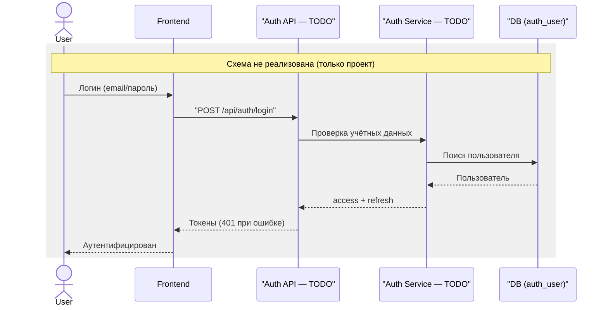

---

## 10. Data Architecture

Сущности (Django-модели `core/models.py`). Все основные id — UUID. Координаты —
WGS-84 (`lat`/`lng`), геометрии — JSON (без PostGIS).

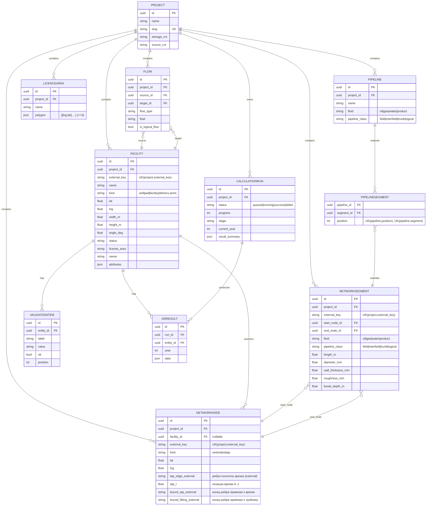

**Ключи, связи, ограничения**

- **PK:** UUID у всех основных сущностей (`Project`, `Facility`, `NetworkNode`,
  `NetworkSegment`, `Pipeline`, `LicenceArea`, `Flow`, `ValidationItem`, `CalculationRun`, `GRResult`);
  у `PipelineSegment` — составной (FK `pipeline`+`position` в ограничениях).
- **FK:** все дочерние сущности ссылаются на `Project` (`on_delete=CASCADE` — удаление
  проекта каскадно уносит содержимое). `NetworkNode.facility` — `SET_NULL`.
- **Уникальность (важно):** `Project.slug`; `UniqueConstraint(project, external_key)`
  у `Facility`/`NetworkNode`/`NetworkSegment`/`Pipeline`/`LicenceArea` (условие
  `external_key IS NOT NULL`) — по ним дедуплицируется сохранение снимка.
  `PipelineSegment`: `UK(pipeline, position)` и `UK(pipeline, segment)`.
- **Сквозной внешний идентификатор `uid`** (`UniqueConstraint(project, uid)`,
  условие `uid IS NOT NULL`) у тех же пяти сущностей. `uid` генерируется
  **клиентом** при создании объекта и НЕ меняется за время жизни сущности —
  в отличие от PK, который пересоздаётся при сохранении снимка. За счёт этого
  domain layer, backend и расчётные модули ссылаются на ОДИН объект по общему
  ключу: `graph_import` делает **upsert по `uid`** (совпал → UPDATE с сохранением
  PK, новый → CREATE, пропал из снимка → DELETE), а `project_snapshot` отдаёт
  `uid` обратно. Пользователю `uid` не показывается.
- **Индексы:** `Flow` — по `(entity_kind, entity_id)` → `TODO`: сейчас у `Flow` индекс
  не объявлен (в исходном проекте был у `FluidBinding`); проверить при необходимости.
- **Порядок:** у сущностей задан `Meta.ordering` (обычно `name, id`); `CalculationRun`
  — `-created_at`.

---

## 11. State Management

Состояние разделено на три вида (React 18):

| Вид | Где | Что хранит |
|---|---|---|
| **Server state** | `@tanstack/react-query` (`api/queries.ts`) | Граф карты (`mapGraph`), детали объекта (`entity`), список сценариев (`scenarios`). Кэш + инвалидация. |
| **Global UI state** | `state/uiState.tsx` (React Context) | `activeModule`, `selectedEntity`, `inspectorTab`, `hiddenIds`, `diagramConfig`, `mapDisplaySettings`, `devMode`, `viewMode`. |
| **Domain (drawing) state** | `features/map/mapDrawing.tsx` (React Context) | `vertices / segments / fittings / taps / areas / pipelines / selections / draft` + история undo/redo. |

**Cache/invalidation:** после сохранения `useSaveGraph` инвалидирует `mapGraph` и
`scenarios`. `staleTime`: граф — 60 c, объект — 30 c, сценарии — 10 c.
**Loading/error:** react-query отдаёт `isLoading`/`error`; инспектор использует
`AsyncState`, API-клиент — `ApiHttpError` (404 обрабатывается отдельно).
**Optimistic updates:** не используются (сохранение — явное действие по кнопке).
**Fallback:** при недоступности backend `api/client.ts` подставляет мок
(`USE_MOCK_FALLBACK = true`) — UI не пустеет.

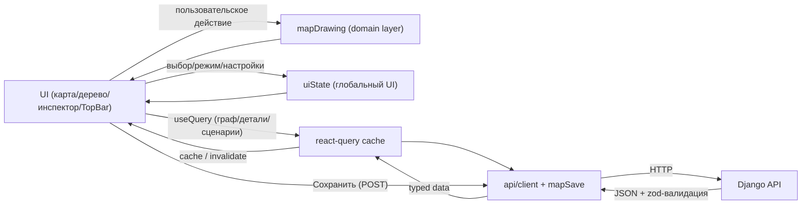

---

## 12. Error Handling

Уровни обработки:

```text
UI (показ сообщения / пустого состояния / ErrorBoundary)
 ↓
API Client (fetch: response.ok, ApiHttpError, NOT_FOUND, mock-fallback)
 ↓
HTTP API (DRF: 400/404/405/500)
 ↓
Validation (сериализаторы DRF, GraphImportError, zod на фронте)
 ↓
Business Logic (graph_import: битые ссылки, транзакция откатывается целиком)
 ↓
Repository / ORM (IntegrityError → 400 у map/save благодаря дедупликации)
 ↓
Database (constraint violation)
```

| Класс ошибки | HTTP | Обработка |
|---|---|---|
| Валидация входа | 400 | Сериализатор/`GraphImportError` → `{error: "…"}`; UI показывает текст |
| Объект/проект не найден | 404 | `get_object_or_404` / явный 404; клиент → `NOT_FOUND` |
| Метод не разрешён | 405 | DRF роутер |
| Нарушение связи (битая ссылка на узел/сегмент) | 400 | `GraphImportError` в `graph_import` |
| Дубли `external_key` | (**ранее 500**) | дедупликация входных данных до создания → 201 |
| Аутентификация | **`TODO`** | нет JWT — 401 не выдаётся, эндпоинты открыты |
| Авторизация | **`TODO`** | роли/permissions не реализованы |
| Непредвиденные ошибки | 500 | Django-логи (`docker compose logs backend`), traceback |
| Ошибка рендера на фронте | — | `ErrorBoundary` локализует сбой зоны (не «белый экран») |
| Сеть недоступна | — | react-query `error` / mock-fallback в `client.ts` |
| Ошибка сохранения | 400/500 | `useSaveGraph.onError` → прогресс красный + текст |

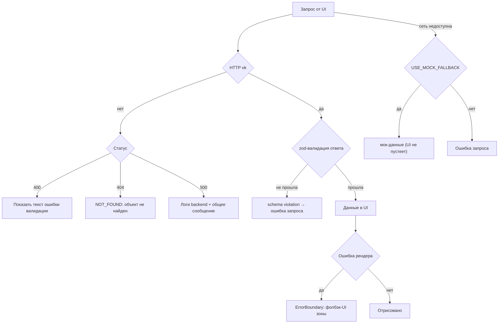

**Логирование:** Django/gunicorn пишет в stderr → `docker compose logs backend`;
фронтенд — `console.warn/error` для fallback и ошибок сценариев. Централизованного
сбора логов (Sentry и т.п.) нет (`TODO`).

---

## 13. Main User Flows

### 13.1. Проектирование объекта и сохранение сценария

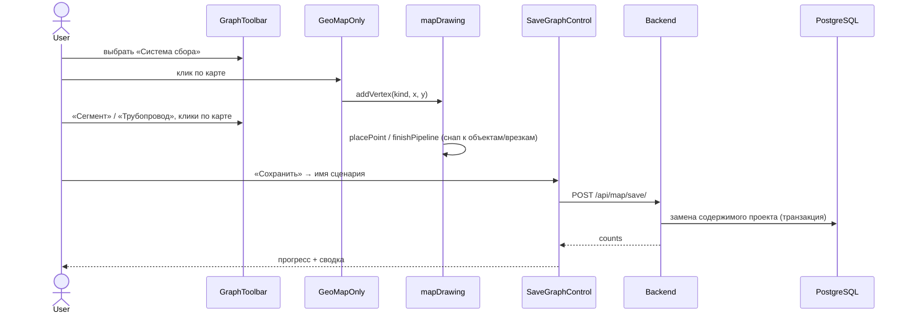

### 13.2. Постановка врезки (разрез сегмента на два)

```mermaid
sequenceDiagram
    actor User
    participant Layer as GeoGraphLayer
    participant MW as MapViewport
    participant Draw as mapDrawing
    participant Split as splitSegmentByTap

    User->>Layer: инструмент «Врезка», клик по ребру
    Layer->>MW: onSegmentPress(edgeId, world)
    MW->>Draw: addTap(edgeId, x, y)
    Draw->>Split: splitSegmentByTap(segments, edgeId, tapPoint)
    Split-->>Draw: два сегмента (left: from→tap, right: tap→to)
    Draw->>Draw: врезка привязана к левому сегменту; segmentCount +1
    Draw-->>Layer: ребро разрезано, врезка — точка стыка
    Layer-->>User: визуально два сегмента + точка врезки
```

### 13.3. Удаление врезки (сшивание ребра обратно)

```mermaid
sequenceDiagram
    actor User
    participant Draw as mapDrawing
    participant Heal as healRemovedTaps

    User->>Draw: выделить врезку + Delete
    Draw->>Draw: removeSelection (taps)
    Draw->>Heal: healRemovedTaps(segments, removedTapIds)
    Heal-->>Draw: два сегмента → один; висячие концы → free
    Draw-->>User: ребро снова единое
```

### 13.4. Импорт лицензионного участка из GeoJSON

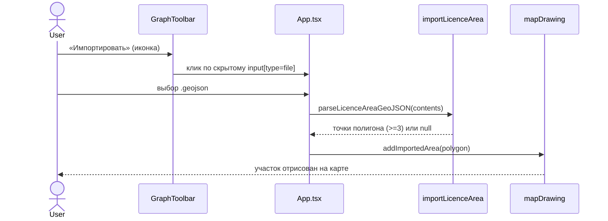

### 13.5. Открытие и удаление сценария

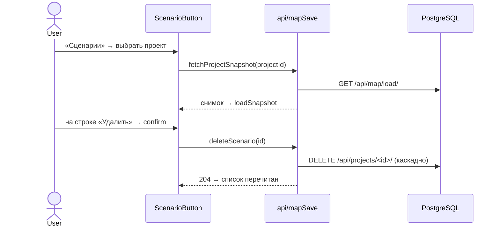

---

## 14. Dependency Graph

Общая карта зависимостей (модули и их связи):

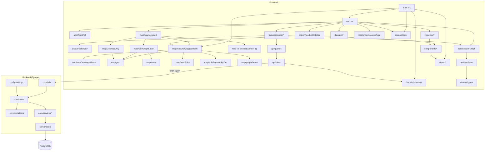

---

## 15. Deployment & Runtime

| Контейнер | Образ/сборка | Порт | Роль |
|---|---|
| `db` | `postgres:16-alpine` | 5432 | База данных (volume `db_data`) |
| `backend` | `backend/Dockerfile` (`python:3.12-slim` + gunicorn) | 8000 | API; при старте `migrate --noinput` |
| frontend (dev) | `vite` (`npm run dev`) | 5173+ | SPA + dev-прокси `/api` → `localhost:8000` |
| frontend (prod) | **не определён** (`TODO / Assumption`) | — | статика; предполагается раздача за одним origin с `/api` |

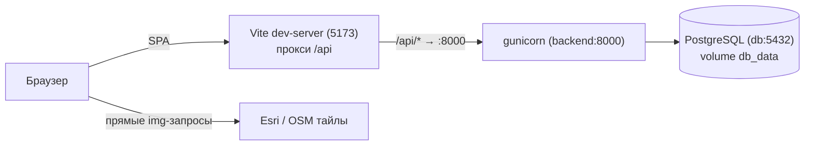

- **CORS (dev):** `DJANGO_CORS_ORIGINS` (по умолчанию `http://localhost:5173`).
- **Конфигурация:** переменные окружения (`backend/.env`), см. `backend/.env.example`.
- **Миграции:** применяются автоматически в `CMD` контейнера backend; вручную —
  `docker compose exec backend python manage.py migrate`.
- **Тесты backend:** `docker compose exec backend python manage.py test` (12 тестов).
- **Основные внешние зависимости:** Java/Node — нет; браузер → тайлы напрямую.

---

## 16. Known Limitations & TODO

| # | Ограничение | Статус |
|---|---|---|
| 1 | **JWT-аутентификация** и роли — не реализованы | `TODO` |
| 2 | **Расчётное ядро ГР/гидравлики** — нет; только `CalculationRun` + чтение `GRResult` | `TODO` |
| 3 | **Импорт pipeline JSON** — не реализован | `TODO` |
| 4 | **Централизованное логирование** (Sentry и т.п.) — нет | `TODO` |
| 5 | **Prod-сборка/раздача frontend** — не определена | `TODO / Assumption` |
| 6 | **Вариант 1 карты (vis-network)** сохранён флагом `MAP_ONLY` в коде | Осознанно (по плану) |
| 7 | **Мок-fallback** `USE_MOCK_FALLBACK = true` в `api/client.ts` — маскирует недоступный backend | Осознанно (dev) |
| 8 | **Аутентификация/авторизация** без `DEFAULT_PERMISSION_CLASSES` — все API открыты | Связано с #1 |
| 9 | **Визуальная проверка UI** невозможна в текущей среде (headless-браузер не работает) | Ограничение среды |
