<div align="center">

# 🛢️ Региональная модель (Regional Model)

### Инженерная геоинформационная веб-платформа для концептуального проектирования, гидравлического анализа и сценарного моделирования нефтегазовой инфраструктуры

[](https://semver.org)
[](https://react.dev)
[](https://www.typescriptlang.org)
[](https://vite.dev)
[](https://www.djangoproject.com)
[](https://www.django-rest-framework.org)
[](https://www.postgresql.org)
[](https://www.docker.com)
[](#-лицензия)

<br/>

[**Обзор**](#-о-проекте) • [**Возможности**](#-ключевые-возможности) • [**Архитектура**](#-архитектурный-комплекс-8-слоёв) • [**Интерфейс**](#-компоновка-интерфейса-appshell) • [**Быстрый старт**](#-быстрый-старт-quick-start) • [**API**](#-спецификация-api) • [**Changelog**](#-история-версий)

</div>

---

## 📌 О проекте

**«Региональная модель»** — специализированный инженерный веб-комплекс для моделировщиков, проектировщиков и аналитиков нефтегазовых активов. Платформа решает задачи:
- **Интерактивной гео-трассировки** наземной технологической сети (кустовые площадки, УПН, ЦПС, ДНС, трубопроводы, врезки, тройники, полигоны лицензионных участков);
- **Управления предметной топологией** через централизованный доменный слой (`Domain Layer`) с гарантией связности графа и сквозной клиентской идентификацией (`uid`);
- **Гидравлического расчёта режимов** транспортировки многофазных углеводородов (нефть, попутный газ, пластовая вода) с контролем перепадов давления $P(L)$ и температур $T(L)$;
- **Сценарного планирования освоения месторождений (2026–2040 гг.)** с план-факт сопоставлением материальных балансов, дебитов и рисков;
- **Автоматизированного экспертного аудита** (Rule Engine) для обнаружения тупиков, разрывов, превышений скоростей течения и формирования календарных дорожных карт.

---

## ✨ Ключевые возможности

| Область | Функционал |
|---|---|
| **🗺️ Векторный GIS-движок** | • Двухсистемная координатная модель ($WGS\text{-}84 \leftrightarrow \text{Canvas Screen Pixels}$)<br/>• 3-уровневый магнитный снеппинг (узлы $\to$ грани площадок $\to$ ребра труб)<br/>• Топологическое деление сегментов врезками (`splitSegmentByTap`) и авто-сшивка (`healSplits`)<br/>• SVG/Canvas анимация направлений потоков флюидов |
| **🔍 Инспектор объекта** | • Панель свойств `ParameterPanel` с 5 специализированными вкладками:<br/>&nbsp;&nbsp;⚙️ **Общие параметры** (инцидентные потоки, чеклист `modelStatus`)<br/>&nbsp;&nbsp;📅 **Период работы** (годы ввода/вывода, таймлайн, ремонты)<br/>&nbsp;&nbsp;📊 **Профиль продукции** (интерактивный график дебитов, лимиты, таблицы)<br/>&nbsp;&nbsp;🚰 **Гидравлический расчёт** (статус актуальности, условия)<br/>&nbsp;&nbsp;⚠️ **Аналитика** (локальные риски и предупреждения) |
| **🎛️ Рабочие модули** | • 🗺️ **Карта (`MapViewport`)** — интерактивное черчение, слои и подложки (Топография, Спутник, Без подложки)<br/>• 📋 **Данные (`DataModuleView`)** — сводные таблицы объектов, профилей и матриц связей<br/>• ⚡ **Гидравлика (`HydraulicCalcView`)** — выделение контуров, краевые условия, профили $P(L)$<br/>• 📈 **Аналитика (`AnalyticsView`)** — движок правил, рекомендации, сравнение сценариев, дорожные карты |
| **💾 ACID Персистентность** | • Атомарное сохранение снимка графа (`POST /api/map/save/`)<br/>• Умный `Upsert` по неизменяемому клиентскому `uid` с сохранением внешних связей<br/>• Строгая двойная валидация: Zod (клиент) $\leftrightarrow$ DRF Serializers (сервер) |

---

## 🛠️ Технологический стек

```mermaid
flowchart LR
    subgraph FrontendStack ["Frontend (SPA)"]
        React["React 18.3"]
        TS["TypeScript 5.7"]
        Vite["Vite 6.0"]
        RQ["@tanstack/react-query 5.102"]
        Zod["Zod 4.6"]
        SheetJS["XLSX 0.18"]
    end

    subgraph BackendStack ["Backend (API & Engine)"]
        Python["Python 3.12"]
        Django["Django 5.2"]
        DRF["Django REST Framework 3.16"]
        Gunicorn["Gunicorn 23"]
        Psycopg["psycopg 3.2"]
    end

    subgraph StorageInfra ["Хранилище & Инфраструктура"]
        PG["PostgreSQL 16 Alpine"]
        Docker["Docker Compose"]
        OSM["Растровые тайлы OSM / Esri"]
    end

    FrontendStack <-->|REST API / JSON| BackendStack
    BackendStack <-->|TCP: 5432| StorageInfra
```



---

## 4. Архитектурный комплекс проекта

Подробная архитектура системы описана в каталоге [`architecture/`](architecture/):

| Документ | Описание подсистемы |
|---|---|
| **[`architecture/README.md`](architecture/README.md)** | **Системный навигатор по архитектурному комплексу** |
| **[`architecture/domain_layer_architecture.md`](architecture/domain_layer_architecture.md)** | Доменный слой, онтология объектов, санитизация ID, реактивные проекции |
| **[`architecture/backend_architecture.md`](architecture/backend_architecture.md)** | Серверная архитектура Django, модели данных (ER), сервисы снимков и REST API |
| **[`architecture/frontend_architecture.md`](architecture/frontend_architecture.md)** | Архитектура интерфейса React, AppShell, 3-уровневая модель состояния, модули |
| **[`architecture/gis_map_engine_architecture.md`](architecture/gis_map_engine_architecture.md)** | Двухсистемные координаты (WGS-84 $\leftrightarrow$ Canvas), снеппинг, деление/сшивка ребер |
| **[`architecture/integration_contract_architecture.md`](architecture/integration_contract_architecture.md)** | Протоколы обмена, сквозной UID, Zod $\leftrightarrow$ DRF контракты, GeoJSON/Excel I/O |
| **[`architecture/hydraulic_calculation_architecture.md`](architecture/hydraulic_calculation_architecture.md)** | Выделение контуров, математические уравнения (Дарси-Вейсбах, Шухов), профили $P(L)$ |
| **[`architecture/analytics_scenarios_architecture.md`](architecture/analytics_scenarios_architecture.md)** | Движок правил (Rule Engine), рекомендации, версионирование сценариев, дорожные карты |
| **[`architecture/devops_infrastructure_architecture.md`](architecture/devops_infrastructure_architecture.md)** | Контейнеризация Docker Compose, сетевое проксирование, эшелоны безопасности, CI/CD |

---

## 📁 Структура кодовой базы

```text
regional_model/
├── architecture/             # 9 архитектурных документов и Mermaid-диаграмм
├── backend/                  # Серверная часть (Django 5 + DRF + PostgreSQL)
│   ├── config/               # Настройки проекта (settings.py, urls.py, wsgi.py)
│   ├── core/                 # Приложение ядра
│   │   ├── models.py         # Модели: Facility, NetworkNode, NetworkSegment, Pipeline, LicenceArea...
│   │   ├── serializers.py    # Сериализаторы моделей и контракты фронтенда
│   │   ├── services/         # Сервисы: graph_import, project_snapshot, entity_details, common
│   │   ├── views.py          # ViewSets и API контроллеры
│   │   └── tests.py          # Автоматические тесты контрактов и транзакций
│   ├── Dockerfile            # Контейнер бэкенда (Python 3.12-slim + Gunicorn)
│   ├── docker-compose.yml    # Оркестрация сервисов backend и PostgreSQL 16
│   └── requirements.txt      # Python зависимости
├── frontend/                 # Клиентская часть (React 18 + TypeScript + Vite)
│   ├── src/
│   │   ├── app/              # AppShell, ActivityBar, разделители (Splitters)
│   │   ├── api/              # HTTP-клиент, React Query хуки, mapSave API
│   │   ├── domain/           # Ядро модели: types, schemas (Zod), elementGroups, entityDetails
│   │   ├── state/            # Глобальный контекст UIState (активный модуль, выбор, видимость)
│   │   ├── features/
│   │   │   ├── map/          # GIS-ядро: MapViewport, GeoMapOnly, GeoGraphLayer, snap, geo
│   │   │   ├── objectTree/   # Дерево элементов (LeftSidebar), GraphToolbar
│   │   │   ├── parameterPanel/# Расширенный инспектор объекта (5 вкладок параметров)
│   │   │   ├── dataModule/   # Модуль «Данные» (Объекты, Профили, Связи, Импорт/Экспорт)
│   │   │   ├── hydraulicCalc/# Модуль «Гидравлические расчеты» (Контур, Границы, Профили)
│   │   │   ├── analytics/    # Модуль «Аналитика» (Риски, Рекомендации, Сценарии, Дорожные карты)
│   │   │   ├── timeRange/    # Нижняя панель-слайдер временного горизонта (2026–2040 гг.)
│   │   │   └── topbar/       # Верхняя панель: сценарии, импорт/экспорт модели, сохранение
│   │   └── styles/           # Дизайн-токены (tokens.css) и глобальная типографика
│   ├── package.json          # Фронтенд-зависимости и скрипты сборки
│   └── vite.config.ts        # Конфигурация Vite и dev-проксирование (/api -> :8000)
├── problem_log/              # Журнал проблем и архитектурных решений
└── package.json              # Корневой package.json для запуска оркестрации
```

---

---

## 🖥️ Компоновка интерфейса (AppShell)

Интерфейс спроектирован по модульной 3-колоночной схеме с плавающими разделителями и полноэкранными оверлей-модулями:
---

## 🚀 Быстрый старт (Quick Start)

### Вариант 1. Развёртывание в Docker (Рекомендуемый)

Убедитесь, что установлены **Docker Engine 24+** и **Docker Compose v2+**.

```bash
# 1. Клонируйте репозиторий
git clone https://github.com/organization/regional-model.git
cd regional-model

# 2. Подготовьте окружение бэкенда
cd backend
cp .env.example .env

# 3. Запустите сервисы базы данных и API
docker compose up -d --build

# 4. Проверьте работоспособность сервисов
docker compose ps
curl http://localhost:8000/api/health/
# {"status":"ok","service":"regional-model"}
```

Параллельно запустите клиентский dev-сервер:

```bash
cd ../frontend
npm install
npm run dev
```

Приложение доступно в браузере по адресу: **`http://localhost:5173`**
*(Vite автоматически проксирует все обращения к `/api/*` на бэкенд `http://localhost:8000`)*.

---

### Вариант 2. Локальный запуск (Local Dev Setup)

<details>
<summary><b>Развернуть инструкцию для локального запуска без Docker</b></summary>

#### Системные требования:
- **Node.js** $\ge 20.18$ (LTS) & **npm** $\ge 10$
- **Python** $\ge 3.12$
- **PostgreSQL** $\ge 16$

#### 1. Запуск Backend (Django + PostgreSQL):
```powershell
cd backend
python -m venv .venv
.\.venv\Scripts\Activate.ps1
pip install -r requirements.txt

# Задайте переменные подключения к БД в .env или окружении
$env:POSTGRES_HOST="localhost"
$env:POSTGRES_PASSWORD="your_password"

python manage.py migrate
python manage.py runserver 0.0.0.0:8000
```

#### 2. Запуск Frontend (Vite + React):
```powershell
cd ../frontend
npm install
npm run dev
```
</details>

---

## 📡 Спецификация API

Контракты соответствуют zod-схемам фронтенда (`src/domain/schemas.ts`) и сериализаторам DRF (`core/serializers.py`):

| Метод | Эндпоинт | Назначение | Контракт |
|:---:|---|---|---|
| `GET` | `/api/health/` | Проверка доступности бэкенда | `{"status":"ok","service":"regional-model"}` |
| `GET` | `/api/map/graph/` | Легковесный граф карты | `MapGraphSchema` (`nodes`, `edges`) |
| `POST` | `/api/map/save/` | **Сохранение снимка графа** (Upsert по UID) | `MapSavePayload` $\to$ `{project_id, counts}` |
| `GET` | `/api/map/load/` | **Загрузка полного снимка** для Domain Layer | `?project_id=<uuid>` или `?project_name=<name>` |
| `GET` | `/api/entities/<id>/` | Детальная карточка сущности для инспектора | `EntityDetailsSchema` (свойства, `modelStatus`) |
| `POST` | `/api/calculations/start/` | Запуск гидравлического расчёта | `CalculationRunSerializer` (`status: queued`) |
| `GET` | `/api/calculations/<id>/` | Опрос прогресса и этапа симуляции | `{status, progress, stage, current_year}` |
| `GET` | `/api/calculations/<id>/results/` | Результаты расчёта по годам ($P, T, Q$) | `GRResultSerializer` (`?year=2028`) |
| `POST` | `/api/pipelines/from-segments/` | Объединение цепочки сегментов в нитку | `PipelineSerializer` |

---

## 📁 Структура репозитория

```text
regional_model/
├── architecture/             # 9 спецификаций архитектурного комплекса (Mermaid)
│   ├── README.md             # Системный навигатор по архитектурам
│   ├── domain_layer_architecture.md
│   ├── backend_architecture.md
│   ├── frontend_architecture.md
│   ├── gis_map_engine_architecture.md
│   ├── integration_contract_architecture.md
│   ├── hydraulic_calculation_architecture.md
│   ├── analytics_scenarios_architecture.md
│   └── devops_infrastructure_architecture.md
├── backend/                  # Серверная часть (Django 5.2 + DRF + PostgreSQL)
│   ├── config/               # Настройки, WSGI, URL routing
│   ├── core/                 # Модели, сериализаторы, сервисы
│   │   ├── services/         # graph_import (Upsert), project_snapshot, entity_details
│   │   ├── models.py         # Facility, NetworkNode, NetworkSegment, Pipeline, Area...
│   │   └── tests.py          # Автотесты контрактов, транзакций и гаверсинуса
│   ├── Dockerfile            # Python 3.12-slim + Gunicorn
│   └── docker-compose.yml    # Backend + PostgreSQL 16 Alpine
├── frontend/                 # Клиентская часть (React 18 + TS 5.7 + Vite 6)
│   ├── src/
│   │   ├── domain/           # Domain Layer (Single Source of Truth, Zod Schemas)
│   │   ├── state/            # UiStateContext
│   │   ├── api/              # React Query хуки и mapSave
│   │   └── features/
│   │       ├── map/          # GIS-движок: MapViewport, GeoGraphLayer, snap, geo
│   │       ├── parameterPanel/# Инспектор: General, Calendar, Product, Hydraulic, Analytics
│   │       ├── dataModule/   # Табличный модуль «Данные»
│   │       ├── hydraulicCalc/# Модуль «Гидравлические расчёты»
│   │       └── analytics/    # Модуль «Аналитика»
│   └── vite.config.ts        # Vite proxy и Code Splitting (vis, xlsx)
└── problem_log/              # Журнал инженерных трудностей и архитектурных решений
```

---

## 🧪 Тестирование и верификация (Quality Gates)

В репозитории настроены строгие контроли качества кода:

```bash
# 1. Линтинг и статический анализ Frontend (ESLint 9 + React Hooks)
npm --prefix frontend run lint

# 2. Strict проверка типов TypeScript и сборка бандла
npm --prefix frontend run build

# 3. Тестирование Backend (Django Test Suite на PostgreSQL / SQLite)
cd backend
python manage.py test
```

---

## 🗺️ Дорожная карта разработки (Milestones)

- [x] **v0.1.0** — Онтология предметной области, базовые модели сущностей и Zod-контракты.
- [x] **v0.2.0** — Каркас интерфейса `AppShell`, дерево объектов `ObjectTree`, фильтрация видимости слоёв.
- [x] **v0.3.0** — Векторный GIS-рендерер поверх растровых карт без сторонних библиотек, TopBar со сценариями.
- [x] **v0.4.0** — Интеграция с PostgreSQL, транзакционный `Upsert` графа по сквозному `uid`, санитизация `cleanNodeId`.
- [x] **v0.4.2** — Инспектор `ParameterPanel` (5 вкладок по макетам), комплекс архитектурной документации (8 слоёв).
- [ ] **v0.4.3** — Дополнение технологических параметров и расширение состава атрибутов по трубопроводам и площадным объектам (диаметры, толщины стенок, шероховатости, эксплуатационные периоды, профили).
- [ ] **v0.4.4** — Bug fix и комплексное улучшение UX (оптимизация сценариев выделения, снеппинга и редактирования графа, сглаживание взаимодействия с панелями).
- [ ] **v0.5.0** — Интеграция расчётного гидродинамического решателя через фоновый воркер Celery / Redis.
- [ ] **v0.6.0** — Корпоративная аутентификация (SSO / Keycloak / OpenID Connect) и ролевая модель (RBAC).

---

## 📜 Лицензия

Проект распространяется под проприетарной лицензией для внутреннего корпоративного использования.
Все права защищены © 2026.
