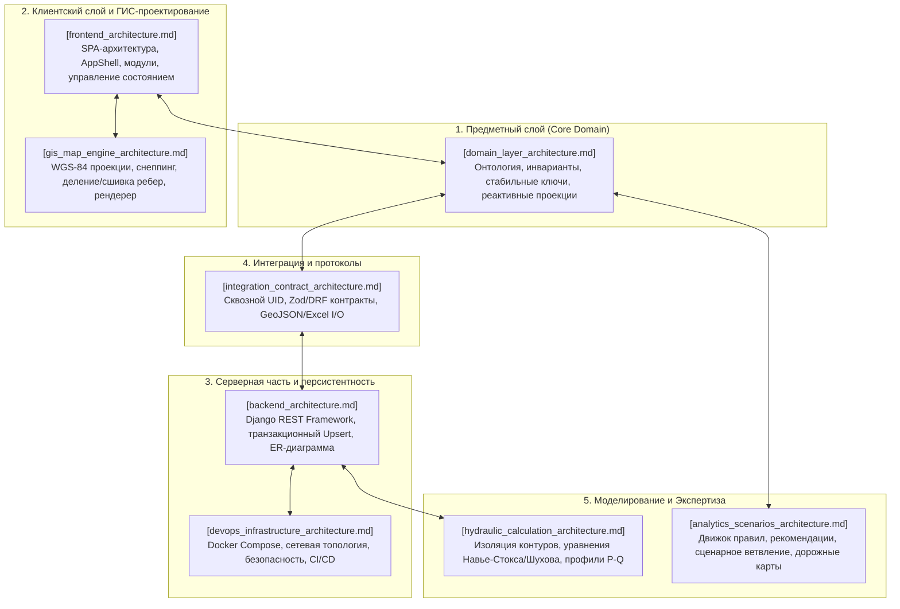

# Архитектурный комплекс проекта «Региональная модель»

> **Единый архитектурный реестр и системный навигатор**  
> Комплексная документация инженерных, программных, интеграционных и инфраструктурных решений проекта.

---

## 1. Системная карта архитектур (Architecture Landscape)

Архитектура системы «Региональная модель» декомпозирована на **8 специализированных архитектурных слоёв**, каждый из которых задокументирован отдельной спецификацией с детальными Mermaid-диаграммами, описанием структур данных и алгоритмов:

---

## 2. Каталог архитектурных документов

| № | Документ | Основной охват и назначение | Ключевые технологии |
|---|---|---|---|
| 1 | **[Архитектура Domain Layer](domain_layer_architecture.md)** | Ядро предметной модели («Single Source of Truth»), онтология нефтегазовой инфраструктуры, таксономия объектов, реактивные проекции дерева, таблиц и инспектора. | TypeScript, Zod, Discriminated Unions |
| 2 | **[Архитектура Backend](backend_architecture.md)** | Реляционная модель данных (ER), сервисы атомарного сохранения графа (`save_map_graph`), REST API эндпоинты, геодезические расчеты. | Python 3.12, Django 5.2, DRF, PostgreSQL |
| 3 | **[Архитектура Frontend](frontend_architecture.md)** | SPA-каркас (`AppShell`), компонентная композиция, 3-уровневая модель состояния (`UiState`, `MapDrawingState`, `React Query`), панели параметров. | React 18, TypeScript 5, Vite 6, React Query |
| 4 | **[Архитектура GIS & Map Engine](gis_map_engine_architecture.md)** | Двухсистемные координаты (WGS-84 $\leftrightarrow$ Canvas), магнитный снеппинг (`snap.ts`), рассечение сегментов врезками (`splitSegmentByTap`), сшивка (`healSplits`), анимация флюидов. | WGS-84, Гаверсинус, Canvas, SVG, OSM/Esri |
| 5 | **[Архитектура Integration & Contracts](integration_contract_architecture.md)** | Сквозная клиентская идентификация (`uid`), двойная валидация контрактов (Zod $\leftrightarrow$ DRF), санитизация идентификаторов (`cleanNodeId`), файловый шлюз (JSON, GeoJSON, Excel/CSV). | Zod Schemas, DRF Serializers, SheetJS, GeoJSON |
| 6 | **[Архитектура Hydraulic & Calculations](hydraulic_calculation_architecture.md)** | Выделение расчетных контуров сети, уравнения движения и теплообмена (Дарси-Вейсбах, Шухов), граничные условия, жизненный цикл расчетных задач (`CalculationRun`), профили давления $P(L)$. | Численные методы, Darcy-Weisbach, Colebrook-White |
| 7 | **[Архитектура Analytics & Scenarios](analytics_scenarios_architecture.md)** | Экспертная система правил валидации рисков, рекомендательный алгоритм инженерных мер, версионирование сценариев, календарные дорожные карты (Roadmaps 2026–2040). | Rule Engine, Scenario Delta Analysis, Gantt Timeline |
| 8 | **[Архитектура DevOps & Infrastructure](devops_infrastructure_architecture.md)** | Контейнеризация (Docker Compose), сетевая топология сервисов, Nginx/Vite проксирование, The Twelve-Factor App конфигурация (`.env`), эшелоны безопасности и CI/CD Quality Gates. | Docker, Docker Compose, Gunicorn, PostgreSQL 16 |

---

## 3. Рекомендации по изучению и работе с кодовой базой

- **Для Backend-разработчиков**: начать с `domain_layer_architecture.md`, затем перейти к `backend_architecture.md` и `integration_contract_architecture.md`;
- **Для Frontend / UI-разработчиков**: изучить `frontend_architecture.md`, `gis_map_engine_architecture.md` и `domain_layer_architecture.md`;
- **Для инженеров-гидравликов и аналитиков**: обратиться к `hydraulic_calculation_architecture.md` и `analytics_scenarios_architecture.md`;
- **Для DevOps и системных администраторов**: руководствоваться `devops_infrastructure_architecture.md`.
