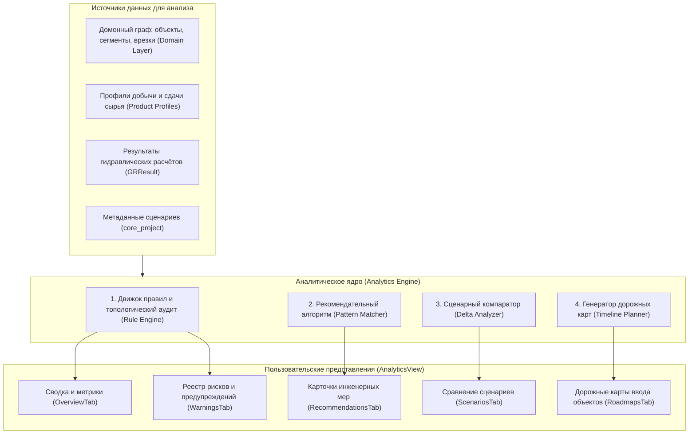
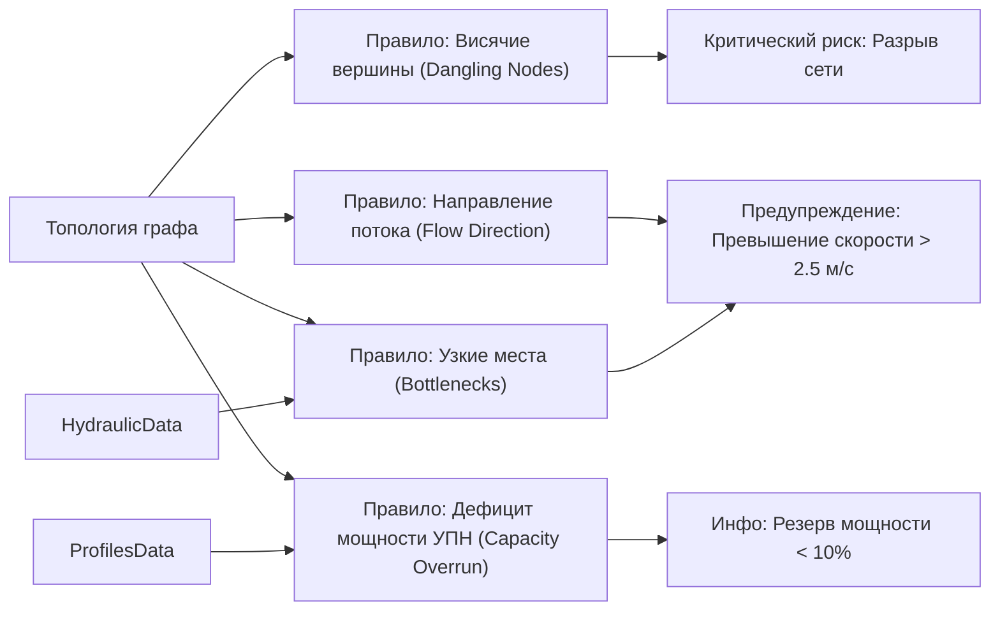
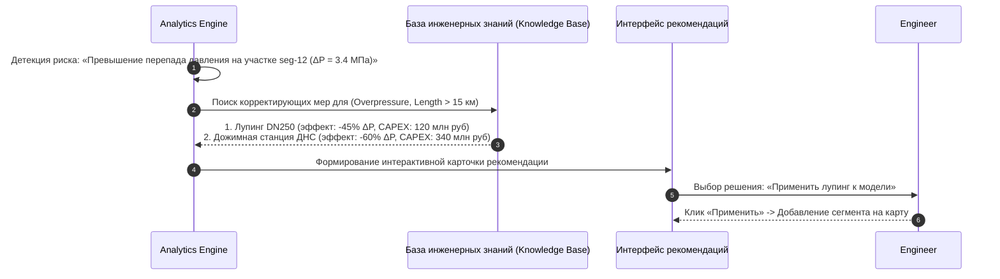
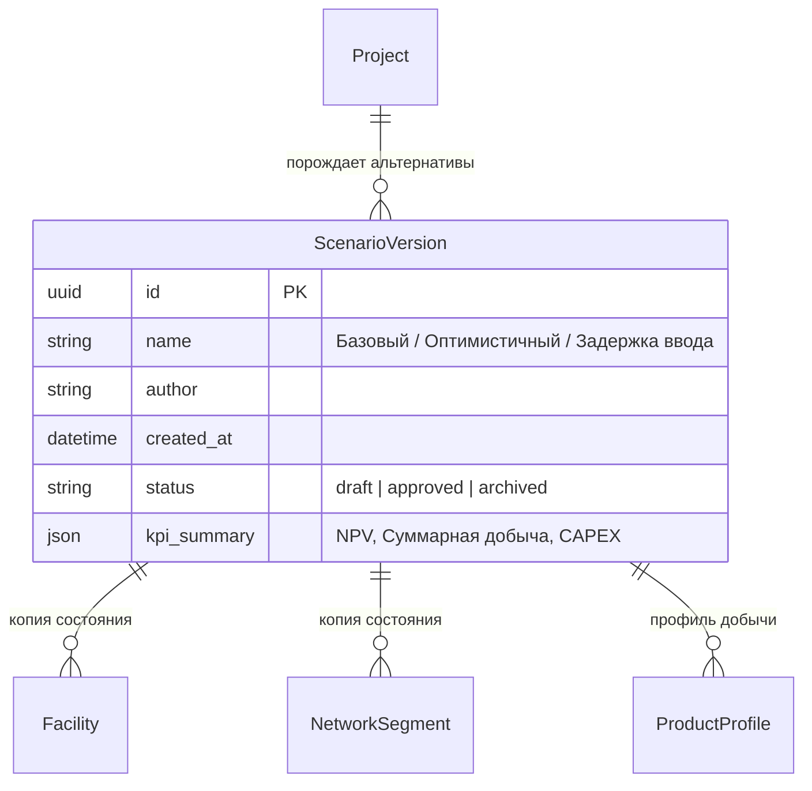
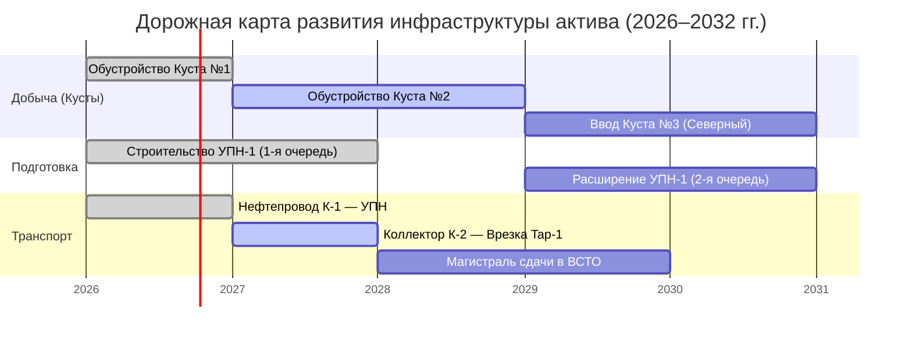

# Архитектура Аналитики, Сценарного моделирования и Дорожных карт (Analytics & Scenarios Architecture)

> **Проект «Региональная модель»**  
> Документация экспертной системы правил, верификации рисков топологии, механизмов сценарного ветвления (Scenarios), рекомендательного движка и календарно-сетевых дорожных карт (Roadmaps 2026–2040).

---

## 1. Назначение и концепция аналитического модуля

Модуль **Analytics & Scenarios** предназначен для комплексной инженерно-экономической экспертизы проектируемой инфраструктуры. Он обеспечивает автоматическое выявление топологических дефектов, оценку достаточности пропускной способности, сравнение альтернативных вариантов освоения лицензионных участков и формирование календарных планов ввода мощностей.

### Ключевые архитектурные принципы:
1. **Rule-Based валидация топологии (Движок правил)**:
   - Анализ графа на разрывы, висячие концы, циклические тупики и несоответствие диаметров без необходимости ручного аудита каждого узла;
   - Классификация инцидентов по уровням критичности: `CRITICAL` (блокирующие расчёт), `WARNING` (технологические риски), `INFO` (рекомендации по оптимизации).
2. **Изолированное сценарное ветвление (Multi-Scenario State)**:
   - Возможность создания независимых сценариев развития актива (например, *«Базовый вариант»*, *«Опережающий ввод Севера»*, *«Консервативный сценарий без ВСТО-2»*);
   - Каждый сценарий хранит собственный снимок проекта (`Project`), топологию и профили добычи, позволяя проводить сравнительный план-факт анализ и сравнение «side-by-side».
3. **Рекомендательный движок (Recommendation Engine)**:
   - Формирование инженерных рекомендаций на основе паттернов перегрузки (предложение лупингов, оптимизация диаметров, перераспределение потоков на соседние ДНС).
4. **Темпоральная синхронизация с горизонтом планирования (2026–2040 гг.)**:
   - Единая привязка аналитики к временному слайдеру `BottomPanel`. Анализ рисков и дорожные карты динамически пересчитываются под выбранный расчётный год.

---

## 2. Общая структурная схема аналитического конвейера

---

## 3. Движок правил и классификация предупреждений (`WarningsTab`)

Анализ выполняется набором независимых инспекторов правил (`RuleInspectors`):

### Каталог встроенных правил валидации:

| Код правила | Категория | Уровень | Условие срабатывания | Предлагаемое действие системы |
|---|---|:---:|---|---|
| `RULE-TOP-01` | Топология | `CRITICAL` | Узел сети `joint` имеет `degree = 1` и не привязан к площадке | Соединить тупиковый узел или удалить сегмент |
| `RULE-TOP-02` | Топология | `CRITICAL` | Сегмент трубы не соединён с приёмным пунктом подготовки | Завершить трассировку нефтепровода до УПН |
| `RULE-HYD-01` | Гидравлика | `WARNING` | Скорость течения нефти $v > 2.5$ м/с | Увеличить диаметр трубы или проложить лупинг |
| `RULE-HYD-02` | Гидравлика | `WARNING` | Температура смеси на входе в УПН ниже точки кристаллизации парафинов | Предусмотреть путевой подогреватель ПП-1.6 |
| `RULE-CAP-01` | Мощность | `WARNING` | Суммарный дебит кустов превышает проектную производительность УПН | Запланировать ввод второй очереди сепарации |
| `RULE-ENV-01` | Лицензирование | `INFO` | Трубопровод пересекает границу лицензионного участка без сервитута | Добавить контрольную точку узла учёта на границе ЛУ |

---

## 4. Рекомендательный алгоритм (`RecommendationsTab`)

Рекомендательный движок сопоставляет выявленные риски с библиотекой типовых инфраструктурных решений:

---

## 5. Сценарное моделирование и версионирование (`ScenariosTab`)

Сценарий в системе — это замкнутая модель инфраструктуры, привязанная к конкретной стратегии разработки:

### Механизм сравнения сценариев (Delta Analysis):
- **Сравнение материального баланса**: сопоставление кривых суммарной добычи нефти и газа по годам;
- **Сравнение капитальных затрат (CAPEX)**: расчет суммарной протяженности трубопроводов по диаметрам и типам флюидов;
- **Матрица рисков**: дифференциальный анализ (в каком сценарии меньше гидравлических узких мест).

---

## 6. Дорожные карты и календарный план (`RoadmapsTab` & `BottomPanel`)

Дорожная карта синхронизирует физический ввод объектов с графиком разбуривания кустов:

### Синхронизация с временным слайдером (`BottomPanel.tsx`):
- При перемещении ползунка года (например, на **2028 год**):
  1. Объекты со сроком ввода $> 2028$ отображаются полупрозрачным «призрачным» стилем (`dashed outline`);
  2. Действующие объекты подсвечиваются номинальным технологическим цветом флюида;
  3. В инспекторе отображаются дебиты именно 2028 года из таблицы профилей `ProductTab`.
