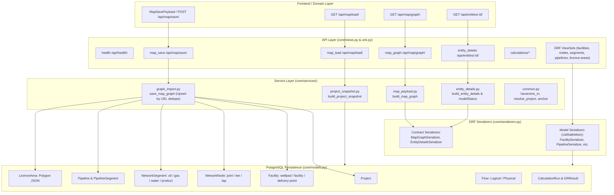
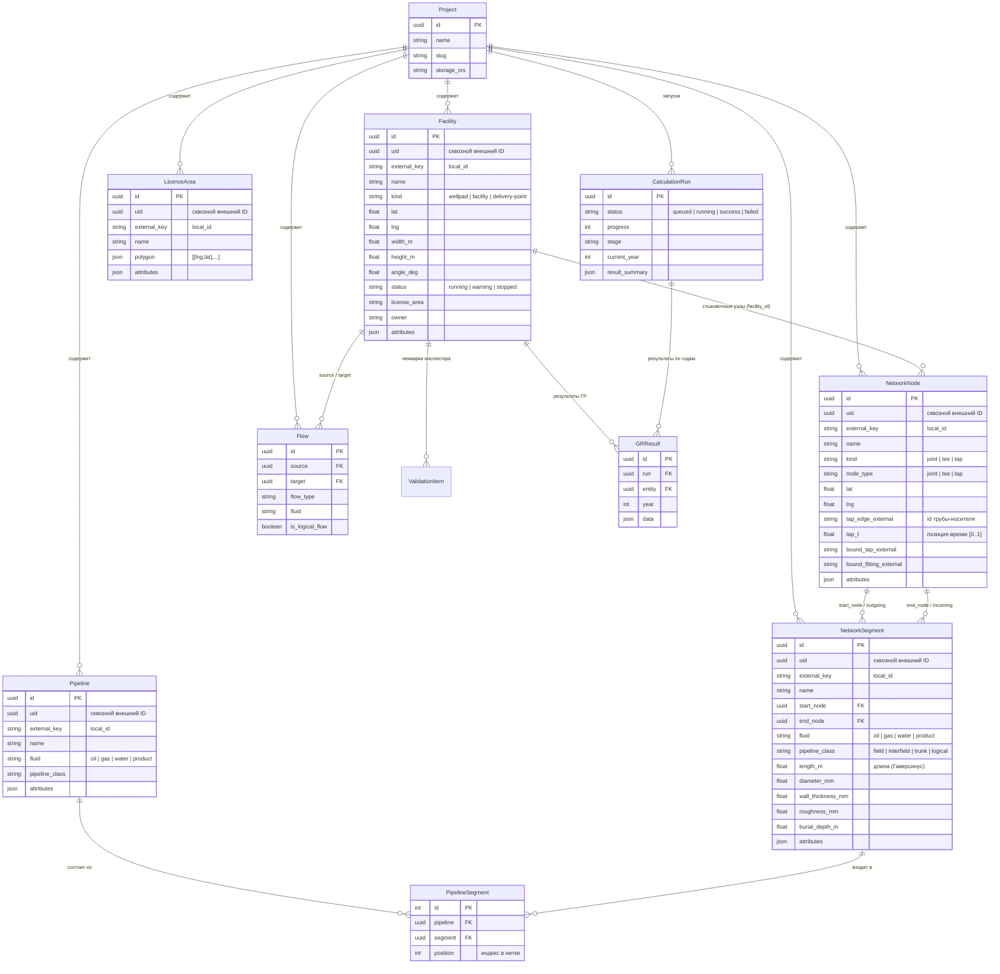
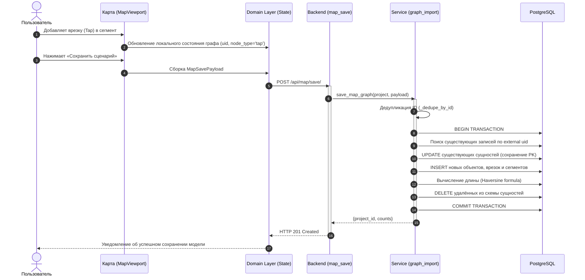

# Архитектура Backend (Серверного слоя)

> **Проект «Региональная модель»**  
> Документация серверной архитектуры, моделей данных, сервисов, REST API контрактов и взаимодействия с Domain Layer фронтенда.

---

## 1. Назначение и концепция Backend

**Backend** проекта «Региональная модель» реализует надёжный персистентный слой, валидацию топологии инженерных сетей, версионирование сценариев моделирования, а также API для взаимодействия с Domain Layer фронтенда и расчётными модулями.

### Ключевые архитектурные принципы:
1. **Сквозная идентификация (`uid`) и семантические ключи (`external_key`)**:
   - `uid` (`UUIDField`): глобальный неизменяемый идентификатор объекта, создаваемый фронтендом. Позволяет обновлять снимки графа методом `Upsert` с сохранением целостности связей и внешних аналитических модулей;
   - `external_key` (`CharField`): семантический локальный идентификатор графа (`facility-1`, `joint-1`, `seg-1`, `tap-1`), приходящий из Domain Layer.
2. **PostGIS-Free геометрия**:
   - Точки (`NetworkNode`, `Facility`): явное хранение WGS-84 координат (`lat`, `lng`);
   - Площадные объекты (`Facility`): центр (`lat`, `lng`) + физические размеры (`width_m`, `height_m`) и угол поворота (`angle_deg`);
   - Полигоны участков (`LicenceArea`): упорядоченный JSON-массив WGS-84 координат `[[lng, lat], ...]`;
   - Геодезические расчёты: высокоточная формула Гаверсинуса в метрической системе без накладных расходов пространственных СУБД.
3. **Строгая синхронизация с Domain Layer фронтенда**:
   - Контракты конечных точек (`GET /api/map/graph/`, `GET /api/entities/<uuid>/`, `POST /api/map/save/`, `GET /api/map/load/`) 1-в-1 соответствуют zod-схемам фронтенда (`MapGraphSchema`, `EntityDetailsSchema`, `MapSavePayload`).
4. **Транзакционность и целостность графа (ACID)**:
   - Сохранение снимка графа выполняется в атомарной транзакции (`@transaction.atomic`), предотвращая рассогласование узлов, сегментов и трубопроводов.

---

## 2. Общая структурная схема Backend



---

## 3. Реляционная модель данных (ER-диаграмма)



---

## 4. Спецификация сервисного слоя (Core Services)

### 4.1. Импорт и сохранение графа (`services/graph_import.py`)
Основная функция: `save_map_graph(project, payload)`.
- **Семантика умного Upsert**:
  1. Выполняет предварительную дедупликацию входных массивов по полю `id` (`_dedupe_by_id`), что предотвращает конфликты `UniqueConstraint(project, external_key)`.
  2. Индексирует существующие сущности проекта по внешнему `uid`:
     - Если сущность со входным `uid` найдена в БД $\to$ поля обновляются в существующей записи (PK, системные связи и зависимости сохраняются).
     - Если `uid` новый или отсутствует $\to$ создаётся новая запись.
  3. Сущности, которых больше нет во входном снимке, удаляются в каскадном порядке: сначала `NetworkSegment`, `NetworkNode`, `Pipeline`, затем `Facility`, `LicenceArea`.
- **Автоматический расчёт длины**: если у сегмента не передана длина `length_m`, сервис рассчитывает её по формуле гаверсинуса между координатами `start_node` и `end_node`.
- **Нормализация типов узлов**: автоматическое выставление `node_type`, `kind` и атрибута `type` (*«Врезка»*, *«Тройник»*, *«Стык трубопровода»*).
- **Сборка состава трубопроводов**: пересборка записей `PipelineSegment` с упорядочиванием по индексу (`position`).

### 4.2. Формирование снимка проекта (`services/project_snapshot.py`)
Основная функция: `build_project_snapshot(project)`.
- Выполняет трансформацию состояния реляционной БД в каноническую структуру снимка проекта, совместимую с `Domain Layer` фронтенда.
- Подставляет `_local_id` (`external_key` или `str(id)`), привязки врезок (`tap_edge_id`, `tap_t`), подключённые фитинги (`bound_tap_id`, `bound_fitting_id`), классы трубопроводов и полигоны участков.
- Возвращает блок мета-счётчиков `counts` (`facilities`, `nodes`, `segments`, `pipelines`, `licence_areas`).

### 4.3. Карточка объекта для инспектора (`services/entity_details.py`)
Основная функция: `build_entity_details(entity_id)`.
- Разрешает полиморфную сущность по идентификатору (`Facility` $\to$ `Pipeline` $\to$ `NetworkNode`).
- **Генерация чеклистов валидации модели (`modelStatus`)**:
  - **Площадной объект (Facility)**: Система сбора, Профиль добычи, Результаты ГР (по данным `ValidationItem`).
  - **Трубопровод (Pipeline)**: Проверка топологической целостности нитки и количества сегментов.
  - **Узел / Врезка (NetworkNode)**: Отображение типа узла, привязки к трубопроводу-носителю и вычисление позиции вдоль трубы в процентах (`tap_t * 100%`).
- Агрегирует списки входящих и исходящих потоков `incoming` / `outgoing`.

### 4.4. Легковесный граф карты (`services/map_payload.py`)
Основная функция: `build_map_graph(project)`.
- Формирует проекцию графа под `MapGraphSchema` фронтенда:
  - `nodes`: отображение объектов `Facility` в маркеры карты (`wellpad`, `processing`, `delivery`);
  - `edges`: отображение `NetworkSegment` со стилизацией (`pipelineClass`), типом флюида (`fluid`) и метками расхода (`flowLabel`).

### 4.5. Геометрические сервисы и сценарии (`services/common.py`)
- `haversine_m(lat1, lng1, lat2, lng2)`: вычисление геодезического расстояния на сфере WGS-84 ($R = 6\,371\,000$ м);
- `facility_anchor_from_click(...)`: расчёт точки стыковки трубы на контуре прямоугольного объекта при клике мышью на карте. Определяет сторону (`n`, `s`, `e`, `w`) и координату среза $t \in [0..1]$;
- `resolve_project_for_save(project_id, project_name)`: выбор или создание проекта/сценария при сохранении снимка карты.

---

## 5. Спецификация REST API и контрактов

### 5.1. Служебные и платформенные эндпоинты

| Метод | URL | Описание | Формат ответа |
|---|---|---|---|
| `GET` | `/api/health/` | Проверка жизнеспособности бэкенда | `{"status": "ok", "service": "regional-model"}` |

### 5.2. Контракты карты и Domain Layer

#### `GET /api/map/graph/`
Получение графа для отображения топологии:
- **Query-параметры**: `project_id` (опционально);
- **Ответ (`MapGraphSchema`)**:
```json
{
  "nodes": [
    {
      "id": "uuid",
      "label": "Куст 1",
      "kind": "wellpad",
      "entityId": "uuid"
    }
  ],
  "edges": [
    {
      "id": "uuid",
      "from": "uuid-start",
      "to": "uuid-end",
      "fluid": "oil",
      "pipelineClass": "field",
      "flowLabel": "—"
    }
  ]
}
```

#### `POST /api/map/save/`
Сохранение нарисованного на карте графа в БД:
- **Тело запроса (`MapSavePayload`)**:
```json
{
  "project_name": "Сценарий 1",
  "project_id": "uuid-optional",
  "facilities": [
    {
      "id": "facility-1",
      "uid": "123e4567-e89b-12d3-a456-426614174000",
      "name": "Куст 1",
      "kind": "wellpad",
      "lat": 61.115,
      "lng": 76.749,
      "width_m": 140,
      "height_m": 100,
      "angle_deg": 0,
      "status": "running",
      "license_area": "Северный",
      "owner": "ГПН-3"
    }
  ],
  "nodes": [
    {
      "id": "joint-1",
      "uid": "123e4567-e89b-12d3-a456-426614174001",
      "name": "Стык 1",
      "kind": "joint",
      "node_type": "joint",
      "lat": 61.115,
      "lng": 76.749,
      "facility_id": "facility-1"
    },
    {
      "id": "tap-1",
      "uid": "123e4567-e89b-12d3-a456-426614174002",
      "name": "Врезка 1",
      "kind": "tap",
      "node_type": "tap",
      "lat": 61.12,
      "lng": 76.755,
      "tap_edge_id": "seg-1",
      "tap_t": 0.42
    }
  ],
  "segments": [
    {
      "id": "seg-1",
      "uid": "123e4567-e89b-12d3-a456-426614174003",
      "name": "Сегмент 1",
      "start_node_id": "joint-1",
      "end_node_id": "tap-1",
      "fluid": "oil",
      "pipeline_class": "field"
    }
  ],
  "pipelines": [
    {
      "id": "pipe-1",
      "name": "Нефтепровод К-1 — УПН",
      "fluid": "oil",
      "pipeline_class": "field",
      "segment_ids": ["seg-1"]
    }
  ],
  "licence_areas": [
    {
      "id": "area-1",
      "name": "Лицензионный участок №1",
      "polygon": [[76.7, 61.1], [76.8, 61.1], [76.8, 61.2]]
    }
  ]
}
```
- **Ответ**:
```json
{
  "project_id": "uuid",
  "project_name": "Сценарий 1",
  "counts": {
    "facilities": 1,
    "nodes": 2,
    "segments": 1,
    "pipelines": 1,
    "licence_areas": 1
  }
}
```

#### `GET /api/map/load/`
Загрузка полного снимка проекта для гидратации `Domain Layer`:
- **Query-параметры**: `?project_id=<uuid>` или `?project_name=<name>`;
- **Ответ**: Полный объект снимка (`project`, `facilities`, `nodes`, `segments`, `pipelines`, `licence_areas`, `counts`).

#### `GET /api/entities/<uuid:entity_id>/`
Детальная карточка сущности для инспектора (панели параметров):
- **Ответ (`EntityDetailsSchema`)**:
```json
{
  "id": "uuid",
  "label": "Куст 1",
  "kind": "wellpad",
  "subType": "Кустовая площадка",
  "status": "running",
  "licenseArea": "Северный",
  "owner": "ГПН-3",
  "modelStatus": [
    {"label": "Система сбора", "value": "подключено", "ok": true},
    {"label": "Профиль добычи", "value": "не задан", "ok": false},
    {"label": "Результаты ГР", "value": "отсутствуют", "ok": false}
  ],
  "outgoing": [],
  "incoming": []
}
```

### 5.3. Расчётные сервисы (Расчётное ядро и ГР)

| Метод | URL | Описание |
|---|---|---|
| `POST` | `/api/calculations/start/` | Постановка задачи на расчёт (создаёт `CalculationRun` в статусе `queued`) |
| `GET` | `/api/calculations/<uuid:run_id>/` | Опрос прогресса расчёта (`status`, `progress`, `stage`, `result_summary`) |
| `GET` | `/api/calculations/<uuid:run_id>/results/` | Результаты расчёта по годам (`?year=2026`) для графиков и таблиц |

### 5.4. Специализированные действия и CRUD

- `POST /api/pipelines/from-segments/`: Сборка выбранных сегментов в именованную нитку трубопровода;
- `POST /api/facilities/<uuid>/nodes/`: Создание нового узла, ассоциированного с площадкой;
- Стандартные CRUD эндпоинты через DRF Router:
  - `/api/projects/`
  - `/api/facilities/`
  - `/api/nodes/`
  - `/api/segments/`
  - `/api/pipelines/`
  - `/api/licence-areas/`
  - `/api/flows/`

---

## 6. Жизненный цикл данных и синхронизация

Диаграмма последовательности демонстрирует полный цикл изменения топологии пользователем на карте и синхронизации с базой данных:



---

## 7. Развёртывание, окружения и тестирование

1. **Конфигурация окружения (`.env`)**:
   - `DJANGO_SECRET_KEY`: секретный ключ Django;
   - `DJANGO_DEBUG`: флаг отладки (0 в production);
   - `POSTGRES_DB`, `POSTGRES_USER`, `POSTGRES_PASSWORD`, `POSTGRES_HOST`, `POSTGRES_PORT`;
   - `DJANGO_CORS_ORIGINS`: список доверенных адресов фронтенда (`http://localhost:5173`).
2. **Docker Compose**:
   - Сервис `db`: PostgreSQL 16 (образ `postgres:16-alpine`), с healthcheck через `pg_isready`;
   - Сервис `backend`: запуск через Gunicorn с автоприменением миграций при старте контейнера (`python manage.py migrate`).
3. **Верификация тестами**:
   - Автоматический запуск тестов командой:
     ```bash
     python manage.py test
     ```
   - Набор тестов проверяет:
     - Живучесть `/api/health/`;
     - Контрактную совместимость `/api/map/graph/` с фронтенд-схемой;
     - Контрактную совместимость карточки объекта `/api/entities/<id>/`;
     - Сохранение и загрузку снимков со всеми типами узлов (`joint`, `tap`, `tee`) и классами труб;
     - Работу механизма дедупликации и расчёта длин сегментов.
