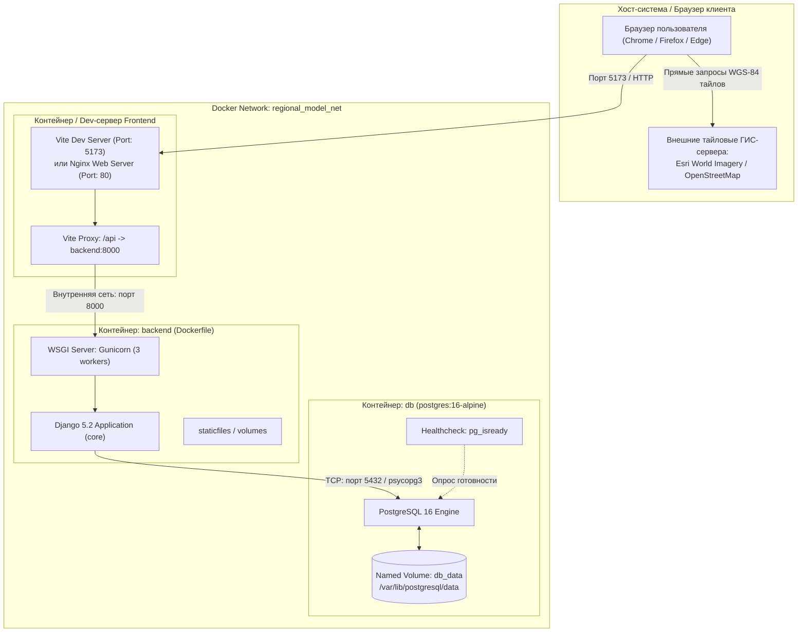
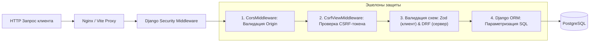
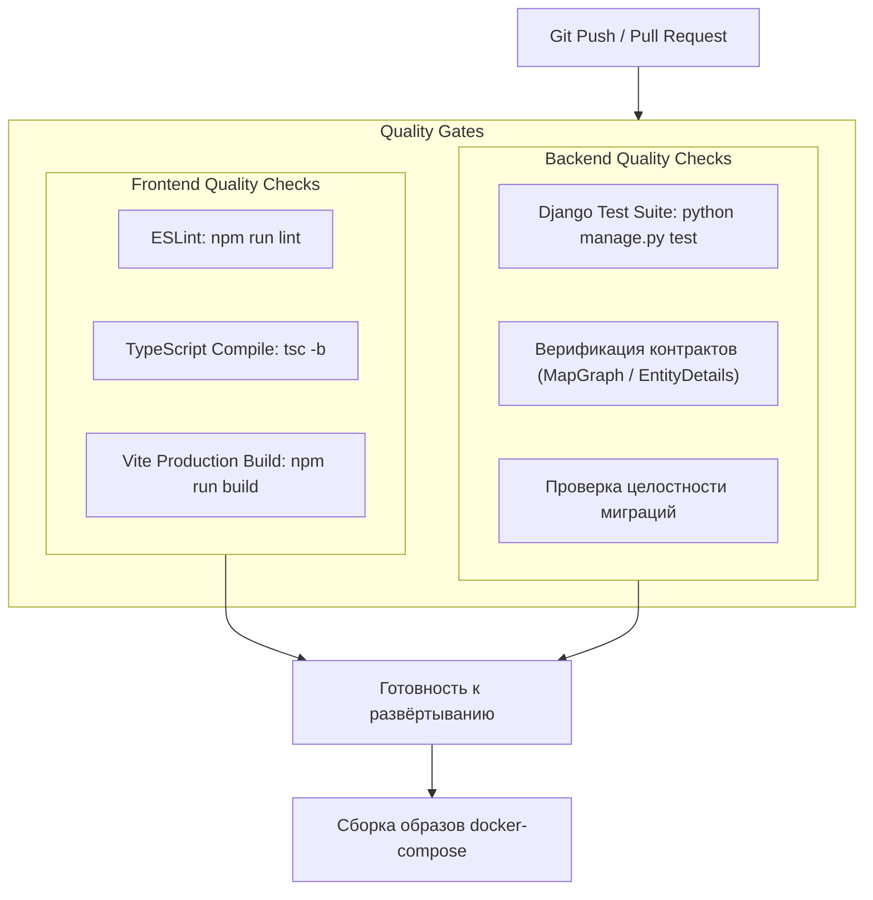

# Архитектура Инфраструктуры, Развёртывания и Безопасности (DevOps & Infrastructure Architecture)

> **Проект «Региональная модель»**  
> Документация контейнеризации, топологии сетевых сервисов, проксирования, управления переменными окружения, персистентности данных, информационной безопасности и CI/CD процессов.

---

## 1. Назначение и концепция инфраструктурного слоя

Инфраструктурный слой обеспечивает надёжное, изолированное и воспроизводимое функционирование всех подсистем «Региональной модели» как в режиме локальной разработки (Developer Sandbox), так и в производственных контурах (Staging / Production).

### Ключевые архитектурные принципы:
1. **Контейнерная изоляция (Containerization)**:
   - Полное разделение сервисов базы данных (PostgreSQL 16 Alpine) и прикладного бэкенда (Python 3.12 / Gunicorn) в управляемой сети Docker Compose;
   - Минималистичные образы на базе Alpine и Debian Slim для уменьшения поверхности атак.
2. **Бесшовное сетевое проксирование (Zero-CORS Development)**:
   - В dev-режиме сервер Vite проксирует запросы `/api/*` напрямую на `http://localhost:8000`, исключая проблемы с Cross-Origin Resource Sharing (CORS) и preflight-запросами `OPTIONS`;
   - В production-контуре единой точкой входа выступает Nginx Reverse Proxy, маршрутизирующий статические ассеты фронтенда и API-вызовы к WSGI-серверу Gunicorn.
3. **Автоматическое управление схемой данных (Zero-Downtime Migrations)**:
   - Контейнер бэкенда при запуске автоматически применяет миграции (`python manage.py migrate --noinput`) только после подтверждения успешного healthcheck базы данных (`pg_isready`).
4. **Безопасность по умолчанию (Security by Design)**:
   - Параметризованные SQL-запросы через Django ORM (защита от SQL Injection);
   - Строгая двухконтурная Zod/DRF валидация входящих JSON-пейлоадов (защита от переполнения буфера и аномальных структур);
   - Вынос чувствительных данных (секретные ключи, пароли СУБД) в переменные окружения (`.env`), исключённые из системы контроля версий Git.

---

## 2. Топология контейнеров и сетевая схема (Deployment Architecture)



---

## 3. Спецификация контейнеров и сервисов

### 3.1. База данных (`db: postgres:16-alpine`)
- **Базовый образ:** `postgres:16-alpine` (минимальный размер, легковесные alpine-бинарники);
- **Порты:** `5432:5432` (проброшен на хост для подключения инструментов DBeaver / Datagrip / psql);
- **Персистентность:** Именованный том `db_data` гарантирует сохранность созданных проектов, сценариев и расчетных данных при пересборке или остановке контейнеров;
- **Healthcheck:**
  ```yaml
  test: ["CMD-SHELL", "pg_isready -U ${POSTGRES_USER:-regional_model}"]
  interval: 5s
  timeout: 5s
  retries: 10
  ```

### 3.2. Прикладной сервер (`backend: python:3.12-slim`)
- **Базовый образ:** `python:3.12-slim` с установкой системных зависимостей `gcc` и `libpq-dev`;
- **Менеджер процессов:** Gunicorn 23 с 3 синхронными воркерами:
  ```bash
  python manage.py migrate --noinput && gunicorn config.wsgi:application --bind 0.0.0.0:8000 --workers 3
  ```
- **Зависимость запуска:** `depends_on: db: condition: service_healthy` (бэкенд не стартует до полной инициализации сокетов PostgreSQL, предотвращая падения конвейера).

### 3.3. Клиентское приложение (`frontend: Vite / React`)
- **Сборщик:** Vite 6 с плагином `@vitejs/plugin-react`;
- **Разделение чанков (Code Splitting):** тяжелые библиотеки вынесены в изолированные бандлы для ускорения первичной загрузки:
  - Чанк `vis`: `vis-network`, `vis-data`;
  - Чанк `xlsx`: табличный процессинг `SheetJS`.

---

## 4. Конфигурация окружения и матрица переменных (`.env`)

Все параметры конфигурируются через переменные окружения в соответствии с методологией **The Twelve-Factor App**:

| Переменная | Назначение | Значение по умолчанию (Dev) | Рекомендация для Production |
|---|---|---|---|
| `DJANGO_SECRET_KEY` | Криптографический ключ подписи сессий и CSRF | `dev-only-secret-key-change-me` | Случайная 64-символьная строка |
| `DJANGO_DEBUG` | Режим подробной отладки | `1` | `0` (строго отключён) |
| `DJANGO_ALLOWED_HOSTS` | Список разрешенных хостов заголовка Host | `localhost,127.0.0.1,backend` | Доменное имя корпоративного портала |
| `DJANGO_CORS_ORIGINS` | Белый список доменов для CORS | `http://localhost:5173` | Адрес продакшн-фронтенда |
| `POSTGRES_DB` | Имя целевой базы данных | `regional_model` | `regional_model_prod` |
| `POSTGRES_USER` | Пользователь СУБД | `regional_model` | Изолированная сервисная УЗ |
| `POSTGRES_PASSWORD` | Пароль пользователя СУБД | `regional_model_change_me` | Криптографически стойкий пароль |
| `POSTGRES_HOST` | Хост подключения к БД | `db` (в Docker) / `localhost` | Имя хоста или кластера Postgres |
| `POSTGRES_PORT` | Порт подключения к БД | `5432` | `5432` |

---

## 5. Архитектура безопасности (Application Security)



### 1. Защита от инъекций (Injection Attacks)
- Исключены «сырые» SQL-запросы (`raw SQL` / `extra`). Все манипуляции со снимками графа и сущностями выполняются через типобезопасный QuerySet API Django ORM с автоматической параметризацией.
### 2. Защита от XSS (Cross-Site Scripting)
- В интерфейсе React данные экранируются при интерполяции JSX;
- Заголовки HTTP response содержат директивы `X-Content-Type-Options: nosniff` и `X-Frame-Options: DENY`.
### 3. Целевая модель аутентификации (Roadmap)
- В текущей версии API открыто для работы инженеров внутри доверенной корпоративной сети;
- В целевой архитектуре запланирован модуль SSO на базе JWT / Keycloak (OAuth2 / OpenID Connect) с разграничением ролей: *Инженер-моделировщик* (полный доступ), *Аудитор* (только чтение), *Администратор* (управление пользователями).

---

## 6. Конвейер сборки, тестирования и CI/CD (Quality Gates)

Перед публикацией релиза или слиянием ветвей выполняется сквозная автоматизированная проверка:



### Команды верификации:
1. **Frontend:**
   ```bash
   cd frontend
   npm run lint        # Проверка линтером правил React Hooks и типов
   npm run build       # Проверка strict компиляции TypeScript и сборки
   ```
2. **Backend:**
   ```bash
   cd backend
   python manage.py test  # Проверка API-контрактов, гаверсинуса, транзакций снимков
   ```
