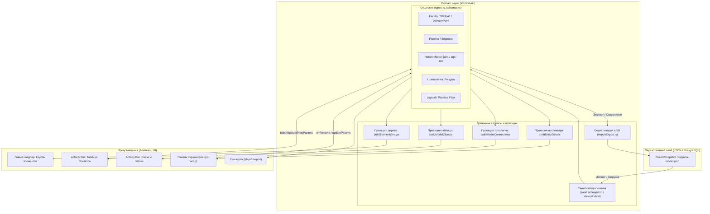

# Архитектура Domain Layer (Доменного слоя)

> **Проект «Региональная модель»**  
> Документация предметной модели, сущностей, связей, проекций и правил трансформации данных.

---

## 1. Назначение и концепция Domain Layer

**Domain Layer** — это ядро системы («Single Source of Truth»), определяющее онтологию нефтегазовой инфраструктуры, технологические правила связности, инварианты данных и проекции для визуализации и редактирования.

### Ключевые архитектурные принципы:
1. **Независимость от представления (UI Agnostic)**: доменные сущности ничего не знают о способе их отображения (карта OpenLayers/Leaflet, граф vis-network, таблица, React-компоненты).
2. **Сквозная идентификация (`uid`)**: каждая сущность обладает постоянным UUID (`uid`), генерируемым на клиенте в момент создания. Этот ключ сохраняется при экспорте, импорте и синхронизации с базой данных PostgreSQL.
3. **Стабильные доменные ключи (`id`)**: взамен технических случайных строк используются семантические идентификаторы:
   - Объекты площадные: `facility-*`, `wellpad-*`, `delivery-point-*`
   - Логические трубопроводы: `pipe-1`, `pipe-2`, ...
   - Физические сегменты: `seg-*`
   - Стыки и узлы сети: `joint-1`, `joint-2`, ... (без накопления мусорных префиксов)
   - Врезки: `tap-*`
   - Тройники: `tee-*`
4. **Реактивные проекции (Projections / Views)**: любые пользовательские интерфейсы (дерево «Группы элементов», таблица «Объекты», матрица «Связи», карточка инспектора «Параметры объекта») являются чистыми проекциями текущего состояния доменного графа.

---

## 2. Структурная схема доменного слоя



---

## 3. Каталог сущностей и классификация

Классификация закреплена в единой мета-таблице `DOMAIN_KIND_META` (`src/domain/elementGroups.ts`):

| Kind | Категория (`category`) | Технологический тип (`typeClass`) | Группа дерева | Назначение в модели |
|---|---|---|---|---|
| `wellpad` | Объект добычи | Кустовая площадка | `group-wellpads` | Источник углеводородного сырья (газ, нефть, пластовая вода). |
| `facility` | Площадной объект | Объект подготовки / станция | `group-facilities` | Технологические площадки (УПН, БМУПН, УКПГ, ПСП, ДНС, КС). |
| `delivery-point` | Площадной объект | Сдача нефти / точка поставки | `group-delivery` | Коммерческие узлы учета, сдача в магистральные системы (ВСТО, Сила Сибири). |
| `pipeline` | Трубопровод | Логический трубопровод | `group-pipelines` | Именованная технологическая нитка (состоит из цепочки сегментов). |
| `segment` | Трубопровод | Сегмент трубопровода | В составе трубы | Физический участок трубы от узла до узла (`fluid`, `pipeline_class`). |
| `node` (joint) | Узел | Стык трубопровода | По координатам | Точка поворота, соединения или границы объекта (`joint-N`). |
| `node` (tap) | Узел | Врезка | `group-taps` | Точка врезки в несущую трубу (`tap-*`, привязка `edgeId`, координата `t`). |
| `node` (tee) | Узел | Тройник | Фитинг | Разветвление потоков (`tee-*`). |
| `area` | Граница | Лицензионный участок | `licence-areas` | Географический замкнутый полигон лицензионного отвода. |

---

## 4. Спецификация доменных модулей

### 4.1. `schemas.ts` & `types.ts`
- **Строгая схема валидации на Zod**: контракты для входящих API-ответов и экспортируемых снимков;
- **Discriminated Unions**: типизация сущностей по дискриминанту `kind`;
- **Доменные атрибуты сущностей (`DomainEntityAttributes`)**:
  - `owner`: владелец объекта (например, *«ГПН-3»*, *«ООО Транснефть-Восток»*);
  - `period`: диапазон эксплуатации (например, *«2026–2040»*);
  - `condition`: технологическое состояние (*«Работает»*, *«Предупреждение»*, *«Остановлен»*);
  - `source`: источник происхождения параметров (*«Модель»*, *«АКСИОМА»*, *«Импорт»*);
  - `status`: агрегированный статус (*`'running' | 'warning' | 'stopped'`*);
  - `licenseArea`: принадлежность к лицензионному участку;
  - `attributes`: открытый словарь технологических параметров (давление, температура, диаметр трубы).

### 4.2. `elementGroups.ts` (Проекции реестров)
1. **`buildElementGroups(input)`**:
   - Агрегирует вершины, сегменты, врезки и трубопроводы в иерархическое дерево;
   - Пустые группы отсекаются;
   - Трубопроводы без сегментов удаляются из дерева.
2. **`buildModelObjects(groups, entityParamMap)`**:
   - Разворачивает дерево в плоский табличный список объектов;
   - Подтягивает параметры (`owner`, `period`, `condition`) напрямую из доменного состояния.
3. **`buildModelConnections(input)`**:
   - Анализирует инцидентность сегментов (`start_node_id`, `end_node_id`);
   - Определяет, физическая ли это труба или логический поток (`pipeline_class === 'logical'`);
   - Вычисляет названия узлов отправления и назначения.

### 4.3. `entityDetails.ts` (Инспектор объекта)
1. **`buildEntityDetails(input)`**:
   - Формирует полную карточку выбранной сущности;
   - Вычисляет входящие (`incoming`) и исходящие (`outgoing`) потоки;
   - Генерирует чеклисты готовности модели (`modelStatus`):
     - Куст: подключение к системе сбора, профиль, результаты ГР;
     - Подготовка: сбалансированность входящих/исходящих связей, технологическая схема;
     - Точка сдачи: коммерческий учет, подключение внешнего транспорта;
     - Трубопровод: целостность цепочки, флюид, длина.
2. **`buildParameterPanelData(entity)`**:
   - Формирует агрегат для правой панели инспектора:
     - `panelKind`: категория панели (`wellpad`, `facility`, `pipeline`, `node`);
     - `workPeriod`: парсинг дат эксплуатации в таймлайн;
     - `productProfile`: подготовленный профиль добычи/поставки;
     - `hydraulic`: готовность к гидравлическому расчету;
     - `analytics`: предупреждения при статусах `warning` или разрывах графа.

### 4.4. `importExport.ts` (Сериализация и I/O)
- **`exportDomainModel` / `downloadDomainModel`**: выгрузка чистого снимка модели в JSON;
- **`parseDomainModelFile`**: чтение с валидацией и предварительной санитизацией;
- **`downloadDomainObjects` / `parseDomainObjectsCSV`**: экспорт и импорт параметров объектов в CSV/Excel формате;
- **`downloadDomainProfile` / `parseDomainProfileTable`**: файловый обмен профилями продукции.

---

## 5. Санитизация и правила нормализации данных

Для предотвращения дефектов сериализации (накопление префиксов `snap-` и машинного кода `sv`) в доменный слой встроен автоматический нормализатор `sanitizeSnapshot`:

```typescript
export function cleanNodeId(rawId?: string | null): string {
  if (!rawId) return '';
  let s = rawId.trim();
  // 1. Срезает любые цепочки префиксов snap- (snap-snap-...)
  s = s.replace(/^(snap-)+/, '');
  // 2. Срезает дублирования врезок и тройников
  s = s.replace(/^(tap-)+/, 'tap-');
  s = s.replace(/^(tee-)+/, 'tee-');
  // 3. Заменяет технический индекс sv20 на канонический joint-20
  s = s.replace(/^sv(\d+)$/, 'joint-$1');
  return s;
}
```

### Пример трансформации снимка:

**До санитизации (грязный снимок):**
```json
{
  "nodes": [
    {
      "id": "snap-snap-snap-snap-snap-snap-snap-snap-snap-sv7",
      "name": "Стык трубопровода 1"
    }
  ],
  "segments": [
    {
      "id": "seg-1",
      "start_node_id": "snap-snap-snap-snap-snap-snap-snap-snap-snap-sv7",
      "end_node_id": "snap-snap-snap-snap-snap-snap-snap-snap-snap-sv8"
    }
  ]
}
```

**После санитизации Domain Layer (чистый снимок):**
```json
{
  "nodes": [
    {
      "id": "joint-7",
      "name": "Стык трубопровода 1"
    }
  ],
  "segments": [
    {
      "id": "seg-1",
      "start_node_id": "joint-7",
      "end_node_id": "joint-8"
    }
  ]
}
```

---

## 6. Двусторонняя синхронизация (Data Flow)

```
Пользователь меняет «Владелец: ГПН-3» в Activity Bar -> «Данные»
                         │
                         ▼
             ObjectsTab.handleApplyBatch()
                         │
                         ▼
        Domain Layer: batchUpdateEntityParams()
     (Обновление MapVertex / PipelineRecord в стейте)
                         │
        ┌────────────────┴────────────────┐
        ▼                                 ▼
buildModelObjects()             buildEntityDetails()
        │                                 │
        ▼                                 ▼
Таблица «Данные» обновлена        Инспектор (pp-wrap)
                                  отображает «Владелец: ГПН-3»
```

Благодаря размещению логики в **Domain Layer**:
1. Любое обновление параметров в таблице сразу же видно в инспекторе на карте.
2. Любой экспорт в JSON/CSV содержит обновленные поля.
3. Сохранение снимка в PostgreSQL отправляет консистентные `owner`, `license_area`, `status` и `attributes`.
