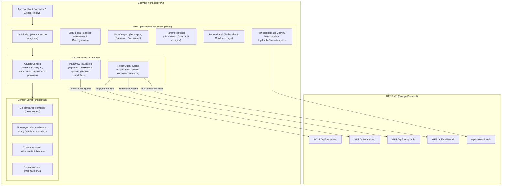
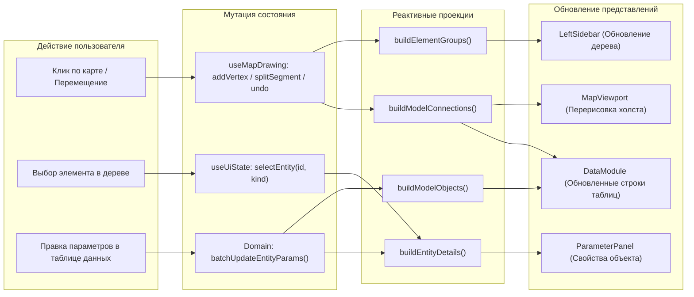
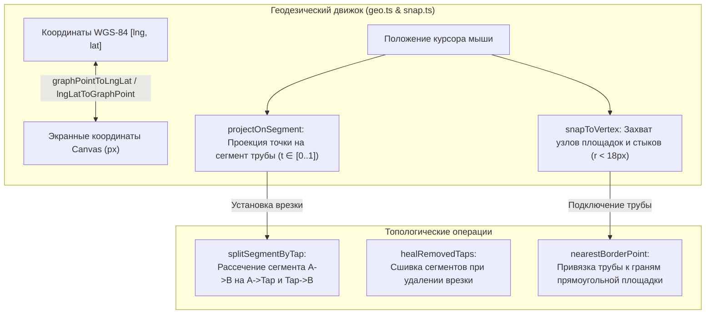
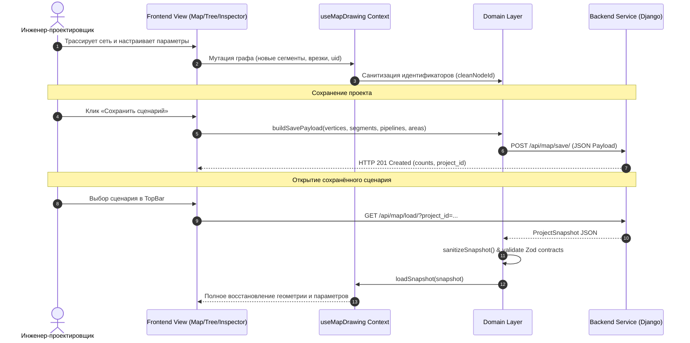

# Архитектура Frontend (Клиентского слоя)

> **Проект «Региональная модель»**  
> Документация архитектуры клиентской части, структуры компонентов, моделей состояния (State Management), подсистемы гео-проектирования и взаимодействия с Domain Layer и Backend.

---

## 1. Назначение и концепция Frontend

**Frontend** проекта «Региональная модель» — это специализированная геоинформационная SPA-система (Single Page Application) для концептуального проектирования, гидравлического анализа, верификации связности и сценарного моделирования объектов сбора, подготовки и транспорта углеводородного сырья.

### Ключевые архитектурные принципы:
1. **Domain-Driven UI (Управление через Доменный слой)**:
   - Вся бизнес-логика классификации, правил валидации графа, проверки готовности модели (`modelStatus`), санитизации идентификаторов (`sanitizeSnapshot`, `cleanNodeId`) и расчета связности сосредоточена в `src/domain/`.
   - UI-компоненты являются реактивными проекциями доменного состояния (`buildElementGroups`, `buildModelObjects`, `buildModelConnections`, `buildParameterPanelData`).
2. **Чёткое разделение слоёв состояния (Separation of Concerns)**:
   - **UI State (`src/state/uiState.tsx`)**: активный модуль (`map`, `data`, `calc`, `analytics`), режимы отображения, ширина и схлопывание панелей, фильтры видимости, выбор сущности (`selectedEntity`);
   - **Drawing / Topology State (`src/features/map/mapDrawing.tsx`)**: рабочий чертёж графа (вершины, сегменты, врезки, тройники, полигоны лицензионных участков, история undo/redo, черновики полилиний);
   - **Server / Cache State (`@tanstack/react-query`)**: кэширование и синхронизация серверных карточек сущностей, сценариев и результатов расчётов.
3. **Геоцентрическая модульная композиция (`AppShell`)**:
   - Единая компоновочная сетка (`ActivityBar` $\to$ `LeftSidebar` $\to$ `MapViewport` $\to$ `ParameterPanel` $\to$ `BottomPanel`);
   - Полноэкранные рабочие пространства-модули (`DataModuleView`, `HydraulicCalcView`, `AnalyticsView`), переключаемые через `ActivityBar` без потери нарисованной на карте топологии.
4. **Интерактивное векторное проектирование**:
   - Масштабируемый координатный движок (`src/features/map/geo.ts`), трансформирующий координаты WGS-84 (`lat`, `lng`) в проекционные экранные координаты;
   - Алгоритмический снеппинг к контурам площадок (`snapToVertex`, `projectOnSegment`), автоматическое рассечение сегментов врезками (`splitSegmentByTap`) и залечивание разрывов (`healRemovedTaps`).

---

## 2. Общая структурная схема Frontend



---

## 3. Компонентная структура и навигация

Приложение организовано по модульному feature-based принципу (`src/features/`):

```
frontend/src/
├── app/                      # Каркас интерфейса
│   ├── AppShell.tsx          # 3-колоночная резиновая сетка с разделителями (Splitters)
│   ├── ActivityBar.tsx       # Левый рельс переключения главных модулей системы
│   └── AppShell.css
├── features/
│   ├── map/                  # Интерактивная гео-карта и чертёж
│   │   ├── MapViewport.tsx   # Интеграция холста, управление событиями мыши
│   │   ├── GeoMapOnly.tsx    # Тайловая OSM-подложка WGS-84
│   │   ├── GeoGraphLayer.tsx # Рендеринг площадок, труб, узлов, врезок и флюидов
│   │   ├── mapDrawing.tsx    # Контекст и бизнес-логика рисования
│   │   ├── snap.ts           # Математика снеппинга курсора к вершинам и граням
│   │   ├── splitSegmentByTap.ts / healSplits.ts # Топологическое деление/сшивка ребер
│   │   └── drawingTypes.ts   # Типы графических примитивов
│   ├── objectTree/           # Иерархическое дерево объектов
│   │   ├── LeftSidebar.tsx   # Сайдбар: вкладка дерева + панель инструментов проектирования
│   │   ├── ObjectTree.tsx    # Виртуализированное дерево с поиском и скрытием слоёв
│   │   ├── GraphToolbar.tsx  # Панель создания (куст, площадка, труба, врезка, тройник)
│   │   └── PipelineDropdown.tsx # Выбор класса и флюида при трассировке
│   ├── parameterPanel/       # Инспектор выбранного объекта (Правая панель)
│   │   ├── ParameterPanel.tsx # Хост панели со сменой вкладок под тип объекта
│   │   ├── GeneralTab.tsx    # Общие параметры, инцидентные потоки, чеклист модели
│   │   ├── CalendarTab.tsx   # Годы ввода/вывода, графики ремонтов и остановов
│   │   ├── ProductTab.tsx    # Профиль добычи и сдачи сырья по годам
│   │   ├── HydraulicTab.tsx  # Готовность и статус гидравлического расчёта трубы
│   │   └── AnalyticsTab.tsx  # Локальные предупреждения и рекомендации
│   ├── dataModule/           # Табличный модуль «Данные»
│   │   ├── DataModuleView.tsx# Контейнер с вкладками: Объекты, Профили, Связи, Импорт/Экспорт
│   │   ├── ObjectsTab.tsx    # Сводная таблица параметров всех элементов с групповой правкой
│   │   ├── ConnectionsTab.tsx# Топологическая матрица соединений и длин труб
│   │   └── ProfilesTab.tsx   # Сводная таблица дебитов углеводородов
│   ├── hydraulicCalc/        # Модуль «Гидравлические расчёты»
│   │   ├── HydraulicCalcView.tsx
│   │   ├── ContourTab.tsx    # Выбор изолированного расчетного контура сети
│   │   ├── TaskSetupTab.tsx  # Граничные условия (давление источника, температура грунта)
│   │   └── ResultsTab.tsx    # Графики перепада давления (P-Q), гидравлический профиль
│   ├── analytics/            # Модуль «Аналитика»
│   │   ├── AnalyticsView.tsx # Сводка рисков, предупреждений и сценариев
│   │   ├── ScenariosTab.tsx  # Сравнение сценариев развития месторождения
│   │   └── RoadmapsTab.tsx   # Дорожная карта ввода мощностей
│   ├── timeRange/            # Временной слайдер (BottomPanel)
│   │   └── BottomPanel.tsx   # Выбор расчетного года (2026–2040) для синхронизации карты
│   └── topbar/               # Верхняя навигационная панель
│       ├── TopBar.tsx        # Хлебные крошки, переключатель «Просмотр / Редактирование»
│       └── SaveGraphControl.tsx # Кнопка «Сохранить сценарий в PostgreSQL»
├── domain/                   # Ядро предметной модели (Domain Single Source of Truth)
│   ├── types.ts & schemas.ts # Discriminated Unions и Zod-схемы
│   ├── elementGroups.ts      # Реактивные проекции списков и связей
│   ├── entityDetails.ts      # Сборка структуры инспектора и чеклистов
│   └── importExport.ts       # Валидированный обмен JSON/CSV/Excel
└── state/
    └── uiState.tsx           # Глобальный контекст состояния интерфейса
```

---

## 4. Архитектура состояний и потоков данных (Data Flow)

Интерфейс спроектирован по принципу однонаправленного потока данных (Unidirectional Data Flow):



### 4.1. Разделение типов состояния
1. **UiState**:
   - `activeModule`: `'map' | 'data' | 'calc' | 'analytics'`;
   - `selectedEntity`: `{ id: string, kind: 'wellpad' | 'facility' | 'pipeline' | 'segment' | 'node' } | null`;
   - `viewMode`: `'view' | 'edit'` (в режиме просмотра блокируются инструменты трассировки);
   - `hiddenIds`: множество ID скрытых объектов (фильтрация отображения на карте).
2. **MapDrawingState**:
   - `vertices`: список площадок и узлов;
   - `segments`: физические участки трубопроводов;
   - `pipelines`: логические нитки, объединяющие цепочки сегментов;
   - `taps` / `fittings`: врезки и тройники с относительными координатами привязки;
   - `areas`: полигоны лицензионных участков;
   - `history`: стек Undo/Redo для шагов проектирования (до 50 состояний).
3. **React-Query State**:
   - `useEntityDetailsQuery(id)`: подгрузка серверных аналитических данных объекта, если он уже сохранён в БД.

---

## 5. Подсистема интерактивного гео-проектирования (Map Engine)

Графическое ядро построено на прямом математическом проецировании без перегруженных внешних библиотек:



### 5.1. Инструменты создания (Draw Tools)
- `wellpad` / `facility` / `delivery-point`: создание площадочных объектов заданных габаритов (по умолчанию $140 \times 100$ м);
- `pipeline`: создание сегментов с автоматическим снеппингом к существующим стыкам или граням площадок;
- `logical-pipeline`: создание логических беструбных потоков передачи флюида;
- `tap`: установка врезки в существующий сегмент трубы с автоматическим разделением на два зависимых ребра и сохранением непрерывности потока;
- `tee`: установка фитинга разветвления потока;
- `licence-area`: интерактивное рисование замкнутого полигона лицензионного отвода (замыкание кликом в стартовую точку).

---

## 6. Панель параметров объекта (ParameterPanel Inspector)

Правая выдвижная панель инспектора формирует расширенную карточку сущности по макетам системы. Состав доступных вкладок зависит от категории объекта (`ParameterPanelKind`):

| Вкладка | Иконка | Площадные объекты (`wellpad`, `facility`) | Трубопроводы (`pipeline`, `segment`) | Узлы и врезки (`node`) | Назначение |
|---|:---:|:---:|:---:|:---:|---|
| **Общие параметры** (`general`) | ⚙️ | ✅ | ✅ | ✅ | Имя, владелец, лицензионный участок, входящие/исходящие потоки, чеклист валидации модели |
| **Период работы** (`calendar`) | 📅 | ✅ | ✅ | ❌ | Год ввода и вывода, активные интервалы, периоды плановых остановов |
| **Профиль продукции** (`product`) | 📊 | ✅ | ✅ | ❌ | Подекадный/погодовой график дебитов нефти, газа, пластовой воды, жидкости |
| **Расчёт** (`hydraulic`) | 🚰 | ❌ | ✅ | ❌ | Параметры гидравлического режима, готовность к гидравлическому расчету |
| **Аналитика** (`analytics`) | ⚠️ | ✅ | ✅ | ❌ | Ошибки связности, превышения проектных мощностей, предупреждения |

---

## 7. Жизненный цикл синхронизации с Backend (Client-Server Protocol)



---

## 8. Сборка, окружение и стандарты кода

1. **Технологический стек:**
   - **Ядро:** React 18.3, TypeScript 5.7, Vite 6.0;
   - **Управление серверным кэшем:** `@tanstack/react-query 5.102`;
   - **Валидация контрактов:** `zod 4.6`;
   - **Табличный процессинг и файлы:** `xlsx 0.18`;
   - **Визуализация графов:** `vis-network 10.1` (вспомогательно для схем) + Custom Canvas/Geo Layer.
2. **Инструкции по сборке и запуску:**
   ```bash
   cd frontend
   npm install
   npm run dev       # Запуск dev-сервера на http://localhost:5173
   npm run build     # Компиляция TypeScript (tsc -b) и production-сборка Vite
   npm run lint      # Проверка кодовой базы через ESLint
   ```
3. **Согласованность стилей:**
   - Модульный CSS с единой палитрой дизайн-токенов (`src/styles/tokens.css`): шрифты, отступы, акцентные цвета углеводородов (нефть — коричневый, газ — синий, вода — голубой).
