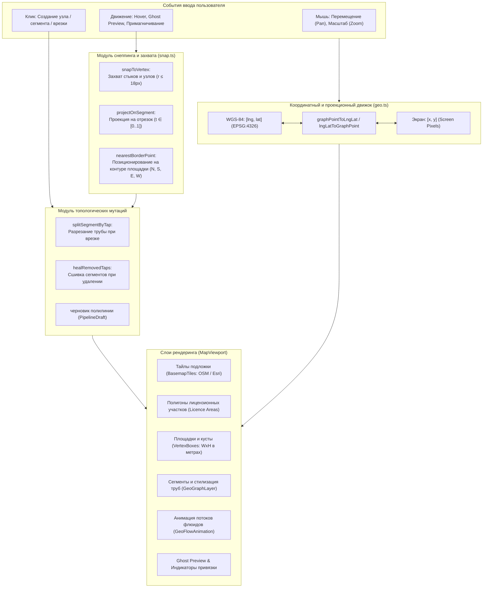
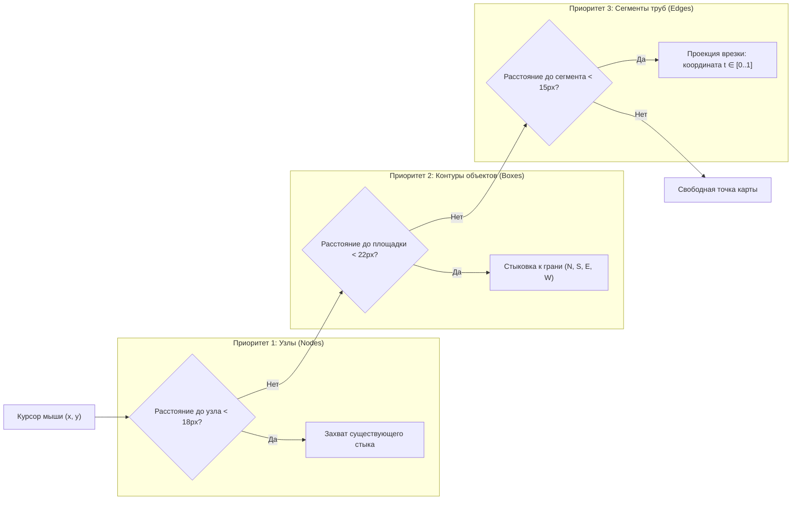
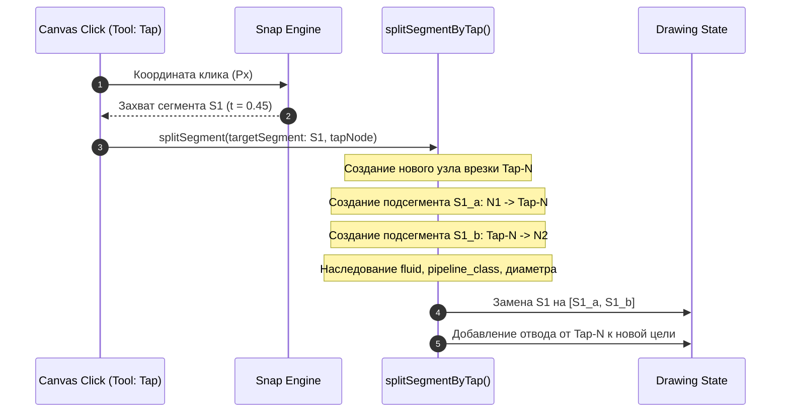

# Архитектура Геоинформационного ядра и Картографического проектирования (GIS & Map Engine)

> **Проект «Региональная модель»**  
> Документация математического аппарата координат, геометрического снеппинга, топологических мутаций графа, визуализации и интерактивного черчения.

---

## 1. Назначение и концепция GIS-ядра

Подсистема **GIS & Map Engine** отвечает за интерактивное визуальное проектирование технологических сетей сбора и транспорта углеводородов поверх картографической гео-подосновы.

### Ключевые архитектурные принципы:
1. **Двухсистемная координатная модель (WGS-84 $\leftrightarrow$ Screen Pixels)**:
   - Внутреннее персистентное состояние и обмен данными оперируют географическими координатами стандарта WGS-84 (`EPSG:4326`, долгота `lng` и широта `lat` в градусах);
   - Экранный рендерер и интерактивные манипуляторы работают в локальных пиксельных координатах холста с непрерывной проекционной трансформацией с учётом масштабирования (`zoom`) и смещения камеры (`pan`).
2. **Топологическая строгость и непрерывность сети**:
   - Любое ребро графа сети (`segment`) опирается на валидные вершины (`nodes`);
   - Врезка (`tap`) топологически разделяет несущий сегмент на два независимых подсегмента, сохраняя гидравлическую непрерывность потока;
   - Удаление врезки автоматически сшивает расщеплённые участки обратно в единый сегмент (`heal splits`).
3. **Адаптивный снеппинг (Magnetic Snapping)**:
   - Автоматический захват курсора к существующим узлам площадок, стыкам труб и ортогональная проекция на линии сегментов с расчётом относительного параметра $t \in [0..1]$.
4. **Легковесный стек без PostGIS и тяжёлых геопорталов**:
   - Проектирование выполняется на чистом HTML5 Canvas / SVG / OpenLayers с тайлами OSM/Esri, а все геометрические расчёты (Гаверсинус, проекции отрезков, пересечения полигонов) выполняются детерминированными математическими модулями.

---

## 2. Архитектурная схема GIS-движка



---

## 3. Математический аппарат координат и проекций

### 3.1. Прямое и обратное преобразование координат (`src/features/map/geo.ts`)

Пересчёт между географическими координатами (WGS-84) и локальной плоской системой координат графа:

```typescript
// Линейное масштабирование для региональных масштабов:
const METERS_PER_DEG_LAT = 111_132.92;
const metersPerDegLng = (lat: number) => 111_320.0 * Math.cos((lat * Math.PI) / 180.0);

export function graphPointToLngLat(pt: { x: number; y: number }, origin: { lat: number; lng: number }): [number, number] {
  const lng = origin.lng + pt.x / metersPerDegLng(origin.lat);
  const lat = origin.lat + pt.y / METERS_PER_DEG_LAT;
  return [lng, lat];
}

export function lngLatToGraphPoint(coords: [number, number], origin: { lat: number; lng: number }): { x: number; y: number } {
  const [lng, lat] = coords;
  const x = (lng - origin.lng) * metersPerDegLng(origin.lat);
  const y = (lat - origin.lat) * METERS_PER_DEG_LAT;
  return { x, y };
}
```

### 3.2. Геодезическое расстояние (Гаверсинус)
Для расчета физической длины трубы между двумя узлами $A(\phi_1, \lambda_1)$ и $B(\phi_2, \lambda_2)$:
$$d = 2 R \arcsin \left( \sqrt{\sin^2\left(\frac{\Delta \phi}{2}\right) + \cos(\phi_1)\cos(\phi_2)\sin^2\left(\frac{\Delta \lambda}{2}\right)} \right)$$
где $R = 6\,371\,000$ метров.

---

## 4. Алгоритмы снеппинга (`src/features/map/snap.ts`)

Снеппинг гарантирует топологическую связанность без зазоров между линиями и объектами:



### 4.1. Проекция на отрезок (Врезка $t \in [0..1]$)
Точка $P$ проецируется на сегмент $AB$. Векторный параметр проекции $t$:
$$t = \frac{\vec{AP} \cdot \vec{AB}}{|\vec{AB}|^2}$$
- Если $t < 0$ или $t > 1$, проекция лежит вне отрезка (захват не срабатывает);
- При $0 \le t \le 1$ вычисляется кратчайшее расстояние $d = |P - (A + t \cdot \vec{AB})|$. Если $d \le R_{\text{snap}}$, курсор притягивается к точке врезки.

### 4.2. Привязка к граням прямоугольного объекта (`nearestBorderPoint`)
Площадка куста или УПН задана центром $(x_c, y_c)$, шириной $W$, высотой $H$ и углом $\alpha$.
Клик вблизи контура транслируется в локальную СК объекта:
1. Вычисляется ближайшая грань: `'n'` (север), `'s'` (юг), `'e'` (восток), `'w'` (запад);
2. Вычисляется доля смещения вдоль грани: $offset \in [0..1]$;
3. Точка фиксируется на границе объекта, образуя входной/выходной технологический штуцер.

---

## 5. Топологические мутации сегментов

### 5.1. Рассечение сегмента врезкой (`splitSegmentByTap.ts`)

При добавлении узла врезки на сегмент $S_{orig}$ между узлами $N_1$ и $N_2$:



### 5.2. Автоматическое залечивание сети при удалении врезки (`healSplits.ts`)
Когда пользователь удаляет узел врезки `tap`:
1. Находятся зависимые сегменты, для которых врезка была концом или началом;
2. Отводной сегмент удаляется;
3. Входной и выходной сегменты несущей трубы склеиваются обратно в единый сегмент $N_1 \to N_2$ с сохранением исходного идентификатора и технологических параметров.

---

## 6. Организация слоёв отображения и рендеринг

Рендеринг организован многослойно для обеспечения частоты кадров 60 FPS:

```
+-------------------------------------------------------+
| Слой 6: HUD & Selection Action Bar (Delete, Настройки)|
+-------------------------------------------------------+
| Слой 5: GeoGhostPreview (Предпросмотр трассы курсора) |
+-------------------------------------------------------+
| Слой 4: GeoFlowAnimation (SVG Dash-анимация флюидов)  |
+-------------------------------------------------------+
| Слой 3: GeoGraphLayer (Трубопроводы, узлы, врезки)    |
+-------------------------------------------------------+
| Слой 2: VertexBoxes (Площадки, УПН, Кусты, Штуцеры)   |
+-------------------------------------------------------+
| Слой 1: LicenceAreas (Полупрозрачные полигоны ЛУ)     |
+-------------------------------------------------------+
| Слой 0: BasemapTiles (Растровые тайлы OSM / Esri)     |
+-------------------------------------------------------+
```

### Стилизация и цветовое кодирование флюидов (`mapColors.ts`):
- **Нефть (`oil`)**: коричневый (`#8B4513`), сплошная линия;
- **Газ (`gas`)**: синий (`#1E90FF`), сплошная линия;
- **Пластовая вода (`water`)**: голубой (`#00CED1`), штриховая линия;
- **Продукт (`product`)**: янтарный (`#FF8C00`), утолщённая линия;
- **Классы трубопроводов**:
  - `trunk` (Магистральный) — ширина 5px;
  - `interfield` (Межпромысловый) — ширина 3.5px;
  - `field` (Промысловый сбор) — ширина 2px;
  - `logical` (Логический переток) — пунктирная линия с динамическим бейджем.

---

## 7. Жизненный цикл черчения и Undo/Redo (`useMapDrawing`)

Вся история мутаций инкапсулирована в кольцевом буфере `history` (до 50 снимков):
- **Операция создания вершины**: клик $\to$ создание `MapVertex` $\to$ добавление в историю;
- **Трассировка полилинии**: клик $\to$ добавление промежуточной вершины $\to$ двойной клик $\to$ закрытие цепочки сегментов $\to$ коммит в историю;
- **Ctrl+Z / Ctrl+Shift+Z**: мгновенный откат/накат стейта без обращений к серверу.
