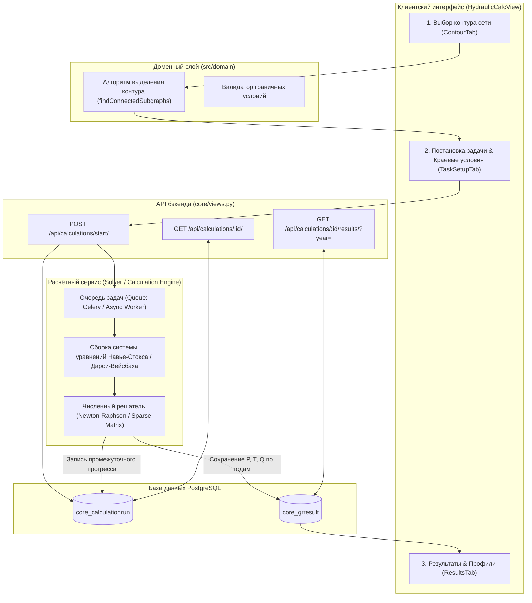
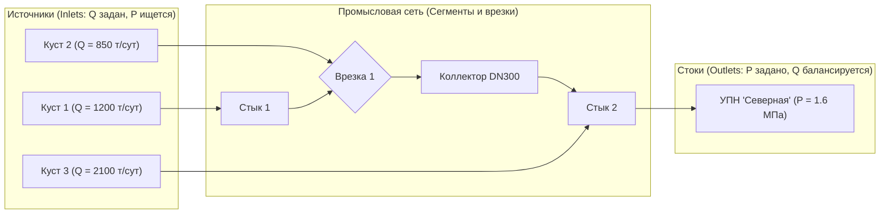
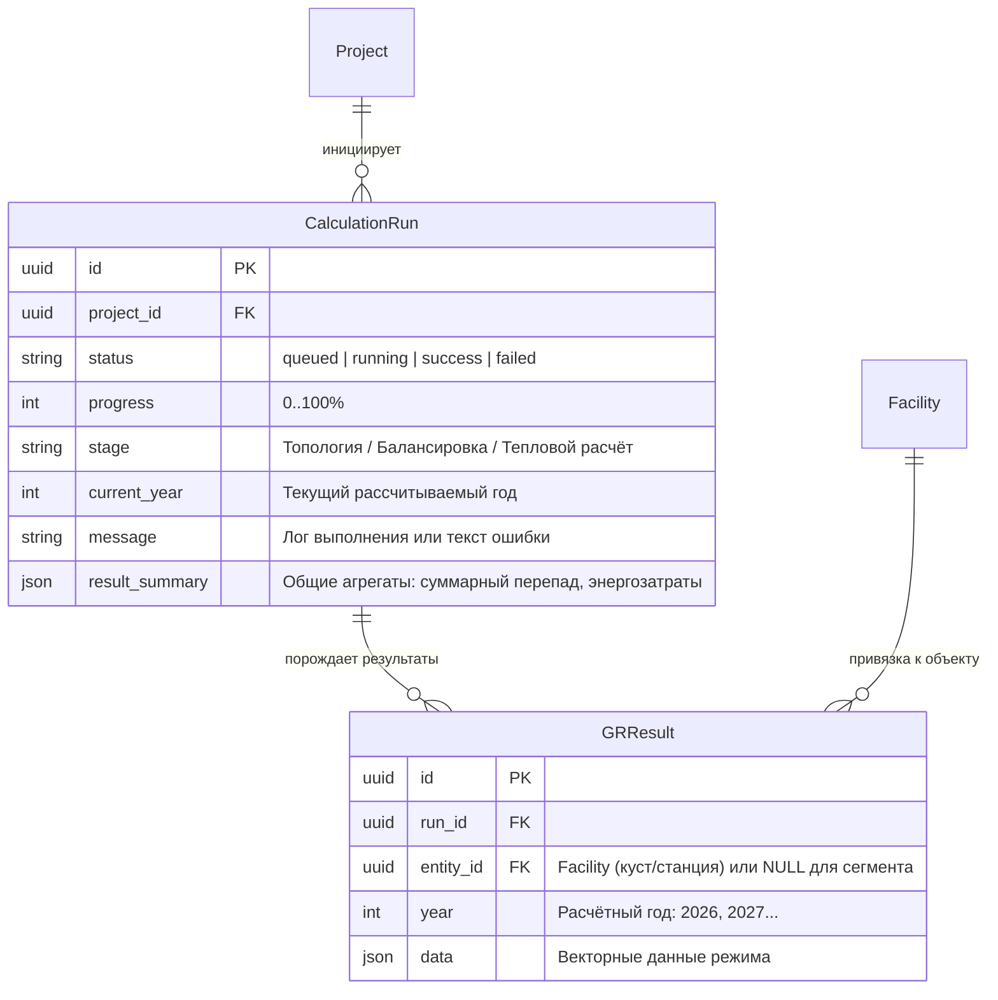
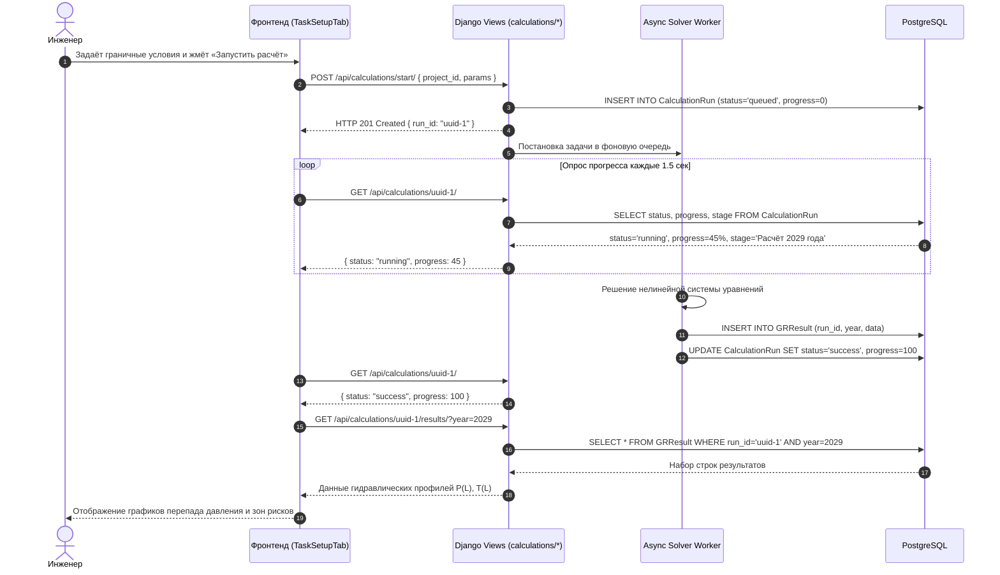

# Архитектура Расчётного ядра и Гидравлического моделирования (Hydraulic & Calculation Engine)

> **Проект «Региональная модель»**  
> Документация математического моделирования трубопроводных сетей, выделения гидравлических контуров, постановки граничных условий, жизненного цикла задач и визуализации результатов.

---

## 1. Назначение и концепция расчётного модуля

Подсистема **Hydraulic & Calculation Engine** предназначена для гидравлического расчёта установившихся и переходных режимов течения многофазных и однофазных флюидов (нефть, попутный газ, пластовая вода) в разветвлённых промысловых и межпромысловых трубопроводных сетях.

### Ключевые архитектурные принципы:
1. **Топологическая изоляция контуров (Contour Isolation)**:
   - Расчёт выполняется не «для всей карты разом», а по изолированным технологическим подграфам (контурам), объединённым общим типом флюида (`oil`, `gas`, `water`) и связностью между источниками (кустовые площадки) и стоками (УПН, ЦПС, точки сдачи).
2. **Асинхронный жизненный цикл расчёта (Async Job Pattern)**:
   - Тяжёлые математические симуляции выполняются в фоновом режиме через сущность `CalculationRun`;
   - Статусная модель: `queued` $\to$ `running` (с процентом прогресса и текущим расчётным годом) $\to$ `success` / `failed`.
3. **Версионность и привязка к расчётному горизонту (Time-Series Alignment)**:
   - Расчёты привязаны к годам эксплуатации месторождения (2026–2040 гг.);
   - Для каждого расчётного шага в модели `GRResult` сохраняются векторные поля давлений, температур, скоростей потока и градиентов трения.
4. **Бесшовная визуализация гидравлических профилей**:
   - Построение пьезометрических линий (профиль давления $P(L)$), температурных кривых $T(L)$ и индикаторов критических режимов (заиливание, эрозия, гидратообразование) в интерфейсе фронтенда.

---

## 2. Структурная схема расчётного конвейера



---

## 3. Топологическое выделение расчётного контура

Расчётный контур строится на основе направленного графа сети:



### Алгоритм изоляции контура:
1. **Фильтрация по флюиду**: из общего графа исключаются сегменты с другим типом флюида (например, водоводы при расчёте нефтепровода);
2. **Поиск связных компонент**: граф обходится алгоритмом BFS/DFS от целевого терминального объекта (`FacilityKind.FACILITY` или `DELIVERY_POINT`);
3. **Определение граничных узлов**:
   - **Входы (Источники сырья)**: кустовые площадки без входящих труб (`in-degree = 0`);
   - **Выходы (Приёмные пункты)**: технологические объекты подготовки без исходящих труб данного флюида;
   - **Внутренние узлы сети**: тройники, врезки и промежуточные стыки (выполняется закон сохранения массы: $\sum Q_{in} = \sum Q_{out}$).

---

## 4. Математическая постановка задачи и уравнения

### 4.1. Уравнение движения (потери давления на трение)
Для каждого сегмента трубы длиной $L$, диаметром $D$ и шероховатостью $\Delta$:
$$\Delta P = \lambda \cdot \frac{L}{D} \cdot \frac{\rho v^2}{2} \pm \rho g \Delta z$$
где:
- $\lambda$ — коэффициент гидравлического сопротивления (формула Кольбрука-Уайта / Альтшуля):
  $$\frac{1}{\sqrt{\lambda}} = -2 \log_{10} \left( \frac{\Delta}{3.7 D} + \frac{2.51}{Re \sqrt{\lambda}} \right)$$
- $Re = \frac{\rho v D}{\mu}$ — число Рейнольдса;
- $\rho g \Delta z$ — гидростатический перепад высот с учётом геодезического рельефа трассы.

### 4.2. Уравнение теплообмена с окружающей средой (формула Шухова)
$$T_{end} = T_{env} + (T_{start} - T_{env}) \cdot \exp\left( -\frac{K \cdot \pi D \cdot L}{C_p \cdot M} \right)$$
где $K$ — коэффициент теплопередачи в грунт, $T_{env}$ — температура грунта на глубине заложения, $C_p$ — удельная теплоёмкость флюида, $M$ — массовый расход.

---

## 5. Граничные условия и параметры задачи (`TaskSetupTab`)

Интерфейс настройки расчёта агрегирует входные данные по четырём группам:

| Группа параметров | Параметр | Единицы | Описание |
|---|---|---|---|
| **Режим стока (Outlet)** | Давление на входе в УПН/ЦПС | МПа ($1.2 \dots 2.5$) | Базовое противодавление приёмного сепаратора |
| **Свойства флюида** | Плотность нефти / воды / газа | кг/м³ | Стандартные условия ($\rho_{oil} \approx 860$, $\rho_w \approx 1020$) |
| | Вязкость динамическая | мПа·с | При рабочей температуре ($5 \dots 25$ сСт) |
| | Газовый фактор (ГФ) | м³/т | Объём растворённого газа ($40 \dots 180$ м³/т) |
| **Внешняя среда** | Температура грунта | °C | Сезонная температура на глубине заложения ($-5 \dots +4$) |
| | Глубина заложения | м | Нормативная глубина траншеи ($1.5 \dots 2.2$ м) |
| **Параметры труб** | Диаметр и толщина стенки | мм | Внутренний просвет трубы $D_{int} = D_{ext} - 2s$ |
| | Эквивалентная шероховатость | мм | Стальные корродированные/новые трубы ($0.04 \dots 0.15$) |

---

## 6. Модель данных расчётов в Backend (`core/models.py`)



### Формат структуры `GRResult.data`:
```json
{
  "entity_type": "segment",
  "segment_id": "seg-101",
  "start_pressure_mpa": 3.84,
  "end_pressure_mpa": 1.72,
  "pressure_drop_mpa": 2.12,
  "flow_rate_m3_day": 1450.0,
  "flow_velocity_m_s": 1.28,
  "start_temperature_c": 32.5,
  "end_temperature_c": 12.1,
  "regime": "turbulent",
  "reynolds_number": 42300,
  "warnings": [
    {
      "code": "HYDRATE_RISK",
      "distance_km": 14.2,
      "message": "Температура потока ниже точки гидратообразования (14.5 °C)"
    }
  ]
}
```

---

## 7. Жизненный цикл выполнения и синхронизация



---

## 8. Отображение результатов (`ResultsTab`)

В интерфейсе модуля результаты симуляции представляются в трёх форматах:
1. **Интерактивный график профиля давления $P(L)$**:
   - По оси X — трасса трубопровода от источника до приёмного пункта (км);
   - По оси Y — гидростатическое и путевое давление (МПа);
   - Ограничительные линии: минимальное давление сепарации и максимальное допустимое рабочее давление (МДРД трубы).
2. **Цветовая кодировка карты**:
   - Перегруженные сегменты (скорость потока $> 2.5$ м/с или $\Delta P > \Delta P_{crit}$) подсвечиваются предупреждающим оранжевым/красным цветом.
3. **Сводная ведомость режимов**:
   - Экспорт результатов гидравлического моделирования по годам в Excel/CSV через модуль I/O.
