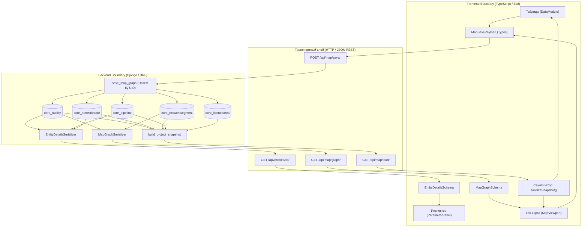
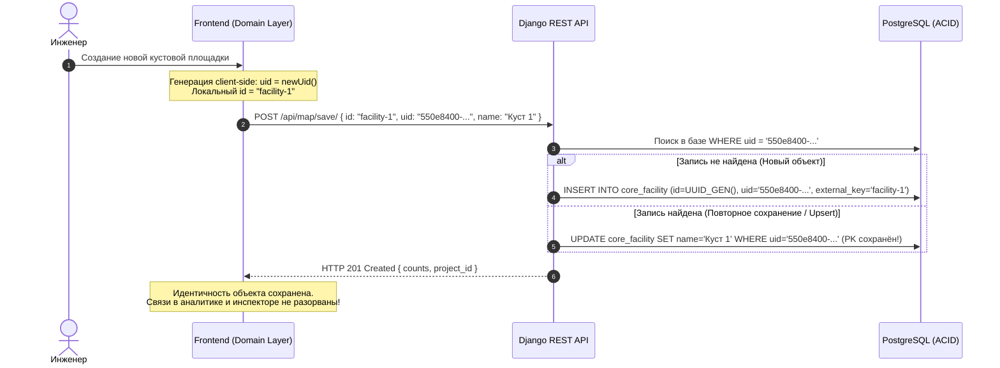

# Архитектура интеграции, синхронизации и контрактов данных (Integration & Contract Architecture)

> **Проект «Региональная модель»**  
> Документация протоколов интеграции, кросс-платформенных контрактов данных, сквозной идентификации (`uid`), схем валидации и файлового обмена (JSON, GeoJSON, Excel/CSV).

---

## 1. Назначение и концепция интеграционного слоя

Интеграционный слой обеспечивает бесшовный обмен данными между реактивным состоянием клиентского интерфейса (TypeScript/React), персистентным хранилищем (Django/PostgreSQL), внешними ГИС-системами и табличными источниками технологических параметров.

### Ключевые архитектурные принципы:
1. **Сквозная идентификация через Client UID**:
   - Первичные ключи реляционной БД (`PK` / `id`) динамически пересоздаются или переназначаются при миграциях и пакетных заменах;
   - Клиент генерирует постоянный сквозной `uid` (`UUID v4`), который сохраняется на всех этапах жизненного цикла сущности и связывает между собой аналитические расчеты, картографический слой, инспектор и базу данных.
2. **Двойная валидация контрактов (Contract-First)**:
   - Клиент: валидация рантайм-схем на базе **Zod** (`frontend/src/domain/schemas.ts`);
   - Сервер: строгие сериализаторы **Django REST Framework** (`backend/core/serializers.py`);
   - Расхождения структур отсекаются до попадания в бизнес-логику или БД.
3. **Санитизация и иммунитет к дефектам сериализации**:
   - Защита от накопления циклических префиксов (`snap-snap-sv7` $\to$ `joint-7`);
   - Нормализация локальных идентификаторов (`external_key`).
4. **Многоформатный файловый шлюз**:
   - Полные снимки сценария моделирования в JSON (`ProjectSnapshot`);
   - Геопространственные полигоны в формате GeoJSON (`FeatureCollection`);
   - Табличные реестры параметров объектов и профилей продукции в CSV / Excel (`SheetJS`).

---

## 2. Сквозная схема движения данных (End-to-End Data Flow)



---

## 3. Матрица соответствия контрактов данных

| Сущность модели | Zod-схема фронтенда | DRF Serializer бэкенда | Таблица PostgreSQL | Ключевые атрибуты согласования |
|---|---|---|---|---|
| **Куст / Объект подготовки / Сдача** | `WellpadNodeSchema` / `FacilitySchema` | `FacilitySerializer` | `core_facility` | `uid`, `kind`, `lat`, `lng`, `width_m`, `height_m`, `status`, `owner`, `license_area` |
| **Узел / Врезка / Стык** | `NodeTypeSchema` | `NetworkNodeSerializer` | `core_networknode` | `uid`, `kind`, `node_type`, `tap_edge_external`, `tap_t`, `facility_id` |
| **Сегмент трубы** | `GraphEdgeSchema` | `NetworkSegmentSerializer` | `core_networksegment` | `uid`, `start_node`, `end_node`, `fluid`, `pipeline_class`, `length_m`, `diameter_mm` |
| **Трубопровод** | `PipelineSchema` | `PipelineSerializer` | `core_pipeline` | `uid`, `name`, `fluid`, `pipeline_class`, `segment_ids` (M2M через `core_pipelinesegment`) |
| **Лицензионный участок** | `AreaSchema` | `LicenceAreaSerializer` | `core_licencearea` | `uid`, `name`, `polygon` (`[[lng, lat], ...]`, $\ge 3$ точек) |
| **Карточка инспектора** | `EntityDetailsSchema` | `EntityDetailsSerializer` | Композитный ответ | `id`, `label`, `kind`, `modelStatus`, `incoming`, `outgoing` |

---

## 4. Паттерн сквозной идентификации (`uid` vs `id`)



---

## 5. Санитизация и нормализация данных (`cleanNodeId`)

Для исключения сбоев при циклическом экспорте/импорте доменный слой применяет конвейер санитизации:

```typescript
export function cleanNodeId(rawId?: string | null): string {
  if (!rawId) return '';
  let s = rawId.trim();
  // 1. Срезает каскадные префиксы снимков: snap-snap-snap-sv1 -> sv1
  s = s.replace(/^(snap-)+/, '');
  // 2. Срезает дублирования врезок и тройников: tap-tap-1 -> tap-1
  s = s.replace(/^(tap-)+/, 'tap-');
  s = s.replace(/^(tee-)+/, 'tee-');
  // 3. Заменяет машинный индекс виз-нетворка sv20 на канонический joint-20
  s = s.replace(/^sv(\d+)$/, 'joint-$1');
  return s;
}
```

---

## 6. Форматы и спецификации файлового обмена (I/O)

### 6.1. Снимок проекта (`ProjectSnapshot` JSON)
Полный дамп состояния сценария моделирования:
```json
{
  "project": {
    "id": "e3b0c442-98fc-1c14-9afb-4c7fae930811",
    "name": "Восточная Сибирь — Базовый",
    "slug": "vost-sib-base"
  },
  "facilities": [
    {
      "id": "facility-1",
      "uid": "123e4567-e89b-12d3-a456-426614174000",
      "name": "Куст 1",
      "kind": "wellpad",
      "lat": 61.115,
      "lng": 76.749,
      "width_m": 140.0,
      "height_m": 100.0,
      "angle_deg": 0.0,
      "status": "running",
      "license_area": "Северный ЛУ",
      "owner": "ООО Газпромнефть-Заполярье"
    }
  ],
  "nodes": [
    {
      "id": "joint-1",
      "uid": "123e4567-e89b-12d3-a456-426614174001",
      "name": "Стык 1",
      "kind": "joint",
      "node_type": "joint",
      "lat": 61.115,
      "lng": 76.749,
      "facility_id": "facility-1"
    }
  ],
  "segments": [
    {
      "id": "seg-1",
      "uid": "123e4567-e89b-12d3-a456-426614174002",
      "name": "Нефтепровод К-1 — УПН",
      "start_node_id": "joint-1",
      "end_node_id": "joint-2",
      "fluid": "oil",
      "pipeline_class": "field",
      "length_m": 2450.5,
      "diameter_mm": 219.0,
      "wall_thickness_mm": 8.0
    }
  ],
  "licence_areas": [
    {
      "id": "area-1",
      "uid": "123e4567-e89b-12d3-a456-426614174003",
      "name": "Северный ЛУ",
      "polygon": [[76.74, 61.11], [76.78, 61.11], [76.78, 61.14], [76.74, 61.14]]
    }
  ]
}
```

### 6.2. Геопространственный формат GeoJSON (Лицензионные участки)
Импорт полигонов отводов (`importLicenceArea.ts`):
```json
{
  "type": "FeatureCollection",
  "features": [
    {
      "type": "Feature",
      "properties": {
        "name": "Западно-Чаяндинский участок",
        "license_number": "ЯКУ-12345-НЭ"
      },
      "geometry": {
        "type": "Polygon",
        "coordinates": [
          [
            [76.7001, 61.1002],
            [76.8505, 61.1002],
            [76.8505, 61.2204],
            [76.7001, 61.2204],
            [76.7001, 61.1002]
          ]
        ]
      }
    }
  ]
}
```

### 6.3. Табличный обмен параметрами и профилями (Excel / CSV)
Экспорт/импорт технологических атрибутов (`downloadDomainObjects` / `parseDomainObjectsCSV`):

| id | Название | Тип объекта | Владелец | Статус | Лицензионный участок | Период эксплуатации |
|---|---|---|---|---|---|---|
| `facility-1` | Куст 101 | Кустовая площадка | ООО «ГПН-Восток» | Работает | Ватьеганский | 2026–2040 |
| `pipe-1` | МН Куст 101 — ЦПС | Трубопровод (Нефть) | ООО «ГПН-Восток» | Работает | Ватьеганский | 2026–2040 |

---

## 7. Обработка ошибок и отказоустойчивость синхронизации

1. **Невалидные топологические ссылки**:
   - Если сегмент ссылается на отсутствующий узел, backend выбрасывает `GraphImportError("Сегмент ссылается на несуществующий узел: node_id")` с кодом `HTTP 400 Bad Request`;
   - Фронтенд перехватывает ошибку и подсвечивает проблемное ребро без сброса несохранённого чертежа на холсте.
2. **Изоляция сбоев сети**:
   - При отсутствии связи с бэкендом состояние проектирования продолжает функционировать в памяти браузера (`In-Memory Local First`);
   - Пользователь имеет возможность в любой момент сделать аварийный локальный экспорт в файл `model_backup.json` через кнопку TopBar без участия сервера.
