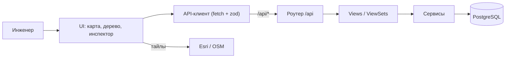

# Проект «Региональная модель»

> Описание продукта по результатам анализа исходного кода репозитория
> (`frontend/`, `backend/`) и проектной документации (`ARCHITECTURE.md`,
> `README.md`, `instructions.md`).

---

## 1. Общая информация: что делает продукт

**«Региональная модель»** — веб-приложение для инженера-моделировщика
нефтегазового актива. Оно предназначено для визуального проектирования и хранения
**региональной модели** — пространственной и технологической структуры
инфраструктуры актива.

Пользователь наносит на гео-карту объекты (системы сбора, объекты подготовки,
точки поставки), соединяет их трубопроводами и сегментами, ставит тройники и
врезки, рисует лицензионные участки, смотрит свойства объектов и
сохраняет/загружает сценарии в базу данных.

### Назначение и ключевые возможности

- **Нанесение объектов на гео-карту**: системы сбора (кустовые площадки), объекты
  подготовки, точки поставки.
- **Соединение трубопроводами и сегментами** с настройкой двух независимых
  характеристик ребра — **флюида** (нефть / газ / продукт, задаёт цвет) и **класса
  трубопровода** (промысловый / межпромысловый / магистральный / логический, задаёт
  стиль линии).
- **Установка тройников и врезок**, в том числе с автоматическим разрезом сегмента
  на два при постановке врезки (`splitSegmentByTap`) и сшиванием обратно при удалении
  (`healRemovedTaps`).
- **Лицензионные участки**: рисование полигонов, импорт из GeoJSON и табличных файлов,
  экспорт в JSON / CSV / GeoJSON.
- **Инспектор объекта** (панель параметров): общие параметры, период работы, профиль
  продукции, гидравлический расчёт, аналитика.
- **Сценарии**: сохранение и загрузка модели в БД, экспорт и импорт полной модели
  в JSON-файл.
- **Ручные манипуляции графом** с отменой и повтором действий (undo/redo).

### Разделение ответственности

Ключевая архитектурная особенность — **доменная модель графа живёт
во фронтенд-приложении** (React-контекст `features/map/mapDrawing.tsx`) и
редактируется непосредственно в браузере. Запись в базу данных выполняется
отдельным шагом — по нажатию кнопки «Сохранить».

| Слой | Ответственность |
|---|---|
| **Frontend** | Отрисовка карты и графа, все ручные манипуляции (создание, перенос, ресайз, удаление), инспектор, дерево объектов, гео-математика |
| **Backend** | Источник истины для сохранённой модели: хранение сущностей, контракты для фронтенда (`map/graph`, `entities/{id}`), атомарное сохранение снимка проекта (`map/save`), загрузка (`map/load`), постановка расчётов |

### Бизнес-ценность

- **Единое цифровое представление** инфраструктуры актива вместо разрозненных файлов
  и схем — модель хранится в базе и воспроизводима.
- **Наглядность**: объекты и связи привязаны к реальным географическим координатам
  и отображаются поверх спутниковых снимков.
- **Сценарный анализ**: разные варианты конфигурации модели сохраняются независимо
  и могут быть открыты и сопоставлены.
- **Задел под расчёты**: структура данных и API подготовлены под геолого-разведочные
  и гидравлические расчёты.

---

## 2. Технологический стек

Система построена по классической схеме «одностраничное веб-приложение + REST API +
реляционная база данных» и разворачивается в контейнерах Docker.

### 2.1. Стек по направлениям

| Направление | Компоненты и технологии | Назначение |
|---|---|---|
| **Интерфейс** | React 18, TypeScript 5 (strict), Vite 6, `@tanstack/react-query` (серверное состояние), `zod` 4 (валидация ответов API), CSS-токены, ESLint | Пользовательский интерфейс: карта с оверлеем графа, дерево объектов, инспектор, панель инструментов, диалоги |
| **Карта** | Web Mercator (тайлы XYZ, 256 px), Esri World Imagery (спутник), OpenStreetMap (топооснова), `vis-network` (альтернативный режим графа) | Отрисовка растровой подложки и гео-привязка объектов, ручное проектирование графа поверх карты |
| **Сервер API** | Django 5, Django REST Framework, gunicorn (3 воркера), `django-cors-headers` | REST-эндпоинты `/api`: граф карты, сохранение и загрузка снимка проекта, карточка объекта, CRUD сущностей, постановка расчётов |
| **Работа с базой** | Django ORM, сервисный слой (`core/services`), транзакции (`atomic`), миграции, upsert по сквозному `uid` | Бизнес-логика и целостность данных: атомарное сохранение снимка проекта, сборка графа карты, чтение карточки инспектора |
| **База данных** | PostgreSQL 16 (`postgres:16-alpine`), драйвер `psycopg` 3, том `db_data` | Хранение проекта, объектов, узлов, сегментов, трубопроводов, лицензионных участков, потоков и результатов расчётов |
| **Картография** | Собственная гео-математика: `lng/lat` ↔ мировые пиксели Web Mercator, формула гаверсинуса для длин, WGS-84; PostGIS не используется | Точные координаты и длины объектов без пространственного расширения БД |
| **Развёртывание** | Docker Compose (`db` / `backend` / `frontend`), nginx 1.27 (раздача SPA и проксирование `/api`), `python:3.12-slim`, `node:20-alpine` | Единый запуск стека одной командой; единый origin без CORS в продакшене |
| **Тесты** | Django `TestCase` + DRF `APIClient` (контрактные тесты API, проверка соответствия схем фронтенда), ESLint (статические проверки TypeScript) | Контроль контрактов frontend ↔ backend и качества кода |

### 2.2. Состав системы

| Компонент | Технология | Расположение |
|---|---|---|
| Frontend | React 18 + TypeScript 5 (strict) + Vite 6 | `frontend/` |
| Backend | Django 5 + Django REST Framework | `backend/` |
| База данных | PostgreSQL 16 (координаты `lat`/`lng`, без PostGIS) | контейнер `db` |
| Тайлы карт | Esri World Imagery, OpenStreetMap | запросы браузера напрямую |
| Аутентификация | не реализована (в планах — JWT) | `TODO` |

### 2.3. Развёртывание: состав контейнеров

| Контейнер | Образ | Порт | Роль |
|---|---|---|---|
| `db` | `postgres:16-alpine` | 5432 | База данных (том `db_data`) |
| `backend` | `python:3.12-slim` + gunicorn | 8000 | REST API; старт с миграциями `migrate --noinput` |
| `frontend` | сборка Vite + nginx 1.27-alpine | 8080 | SPA и проксирование `/api` на backend |

