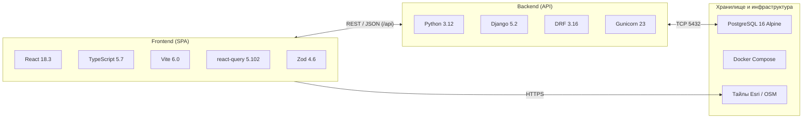

# Технологический стек

Сводка технологий проекта «Региональная модель». Версии взяты из
`frontend/package.json`, `backend/requirements.txt`, `README.md` и `ARCHITECTURE.md`.

## Frontend (`frontend/`)

| Технология | Версия | Назначение |
|---|---|---|
| React | 18.3 | UI-фреймворк |
| TypeScript | 5.7 (strict) | Язык |
| Vite | 6.0 | Dev-сервер и сборка; в dev проксирует `/api/*` на `http://localhost:8000` |
| @tanstack/react-query | 5.102 | Загрузка и кэширование серверных данных |
| Zod | 4.6 | Рантайм-валидация ответов API; TypeScript-типы выводятся из тех же схем |
| vis-network | 10.1 | Отрисовка графа (только «Вариант 1» карты); вынесен в отдельный чанк `vis` |
| xlsx (SheetJS) | 0.18 | Импорт/экспорт Excel; вынесен в отдельный чанк `xlsx` |
| ESLint 9 + typescript-eslint | — | Линтинг (плагины React Hooks и React Refresh) |

Доменная модель графа трубопроводов и логика её редактирования работают в браузере
(`features/map/mapDrawing.tsx`): объекты добычи, объекты подготовки, сегменты, врезки,
участки. Backend только сохраняет и отдаёт снимки модели.

## Backend (`backend/`)

| Технология | Версия | Назначение |
|---|---|---|
| Python | 3.12 | Среда выполнения (образ `python:3.12-slim`) |
| Django | 5.2 | Веб-фреймворк и ORM; одно приложение `core` |
| Django REST Framework | 3.16 | REST API под префиксом `/api` |
| django-cors-headers | 4.6 | Обработка CORS |
| Gunicorn | 23 | Production-сервер в Docker |
| psycopg | 3.2 | Драйвер PostgreSQL |

Фоновые задачи и авторизация пока не реализованы (`TODO` в `ARCHITECTURE.md`).

## Хранилище и инфраструктура

- **PostgreSQL 16 (Alpine)** — база данных. PostGIS не используется: координаты
  хранятся в обычных полях `lat` / `lng`.
- **Docker Compose** — запуск контейнеров backend и базы данных; в проекте также есть
  конфигурация `nginx.conf`.
- **Тайлы карт** — спутниковые снимки Esri World Imagery и OpenStreetMap, браузер
  загружает их напрямую.

## Взаимодействие компонентов

- Frontend ↔ Backend: REST / JSON по относительному префиксу `/api`
  (в dev — через прокси Vite).
- Backend ↔ PostgreSQL: TCP, порт 5432.
- Frontend → поставщики тайлов: прямые запросы из браузера.
